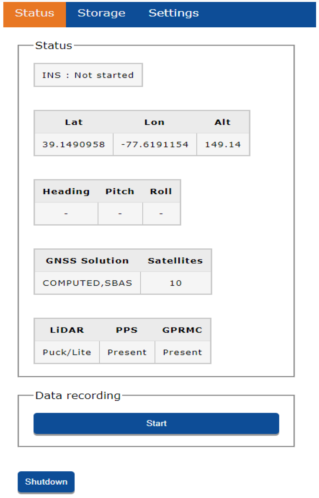
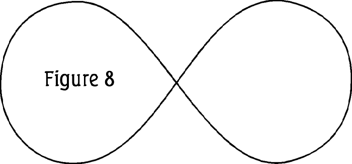

# Calibrating the LiDAR

!!! tip ""
    Before each acquisition and at the end of each acquisition the LiDAR system needs to be calibrated.

## Overview

!!! danger "Make Sure"
    Before proceeding to the LiDAR Calibration make certain the base station is setup and logging static RINEX 3.03 measurements

Calibrating the LiDAR is an important step to collecting accurate data, and the procedure will be done twice at each acquisition session.  One time at the beginning, right after you start the R1A from the WebServer. (See [Connecting to R1A WiFi](../quickstart/first-setup) for information oh how to start the R1A from the web interface) and one time at the very end of your acquisition flights.

## Procedure

####Start the R1A LiDAR
:   Using the web interface, wait until you have 8 or more GNSS satellites. Then press the start button
    inside the data recording window.

{: style="width: 350px;margin:0 auto;display:block;"}

####Collect Static Data
:   The R1A needs to get a static alignment. After you start data recording, then let the R1A
    sit completely still and allow a clear view of the sky and wait 15 seconds. Once the app interface says 'Waiting for high speed kinematic alignment' you can proceed to the next step.

####Kinematic Alignment

1. Take off and fly directly vertical.
1. For at least **6 seconds** fly greater than **7 m/s** in a straight line in the **forward** direction of flight.

####Fly figure 8 pattern
3. Now fly 2 figure 8 patterns in the sky.

{: style="width: 600px;margin:0 auto;display:block;"}

  <figcaption>Figure 1</figcaption>

####Fly your mission
:   Great!  Now the LiDAR is calibrated and you can begin flying your mission plan. Either upload the
    mission while still in the air or land upload and take off again!

**Calibration Complete**

## Mid-mission Battery Change

If your mission will require multiple battery changes, fly directly forward back to the landing zone at a speed greater than **7 m/s**. Once you get overhead, do not exceed 2 m/s in horizontal speed while you turn the drone and bring it in for a landing.

Keep the drone on the ground for no longer than **2 Minutes** while you change the batteries. If you remain on the ground for much longer than 2 minutes you are better off proceeding to the [shutdown proceedure](../quickstart/first-setup). Assuming you take off within the 2 minute window:

1. Take off and fly directly vertical.
1. For at least **6 seconds** fly greater than **7 m/s** in a straight line in the forward direction of flight toward your next waypoint and then resume the mission.

## End of Mission Calibration

At the end of your mission, fly directly forward back to the landing zone at a speed greater than **7 m/s**. Once you get overhead, do not exceed 2 m/s in horizontal speed while you turn the drone and bring it in for a landing.

Once landed don't move the system for 15 seconds.  This will capture a final static alignment dataset.    Then you can connect via the web interface and stop collecting data.

**You are Done!**
