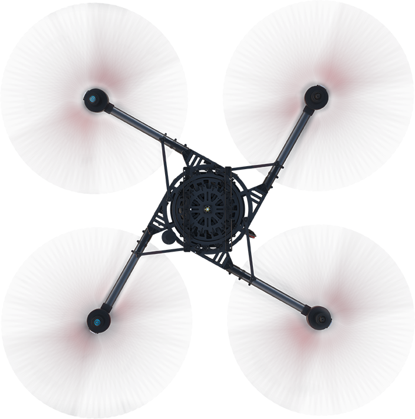

# Freefly Alta-X Setup

{: style="width: 100%;margin:0 auto;display:block;margin-bottom: 25px;"}

The ROCK R1A mounts to the Alta X using a 'Toad in the hole' mount (sold separately). The R1A will need a 4 cell LiPO battery to power the system.

## Antenna

Included with the mount is an antenna which uses one of the free holes on top of the drone to be affixed to the drone.