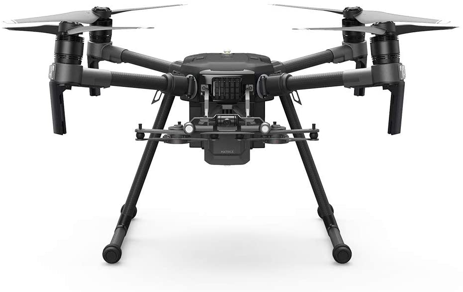

# DJI Matrice 210 Setup

{: style="width: 100%;margin:0 auto;display:block;margin-bottom: 25px;"}

The ROCK R1A connects directly to the DJI Matrice 210 using the vibration dampening Skyport. The R1A will draw power from the system's battery once connected.

# Antenna

The included antenna is to be screwed into one of the screw holes on the top of the drone.