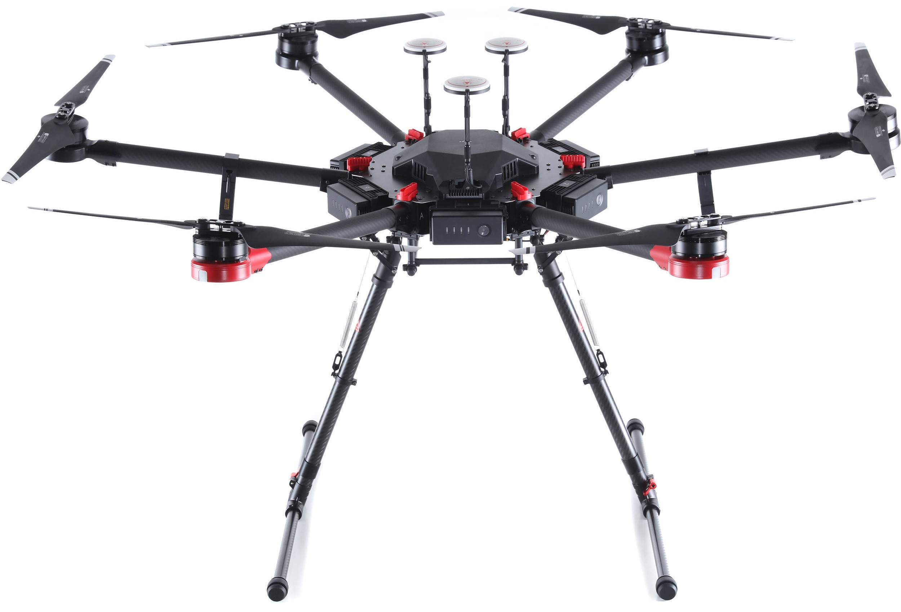

# DJI Matrice 600 Setup

{: style="width: 100%;margin:0 auto;display:block;margin-bottom: 25px;"}

The ROCK R1A mounts to the M600 using a vibration dampening mount (sold separately). The R1A will need a 4 cell LiPO battery to power the system.

## Antenna

Included with the R1A mount is an antenna bracket which is to be screwed into the top of the M600 using one of the free screw holes.