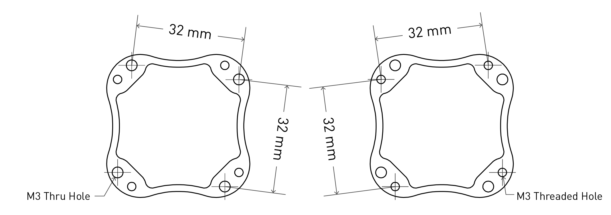

# Other Drone Systems

The ROCK R1A can be purchased with a universal mount which connects to the drone using the M4 Toad in the Hole by Freefly Systems. The mounting portion which needs to be connected to your drone is the [M4 Quick Release Receiver](https://store.freeflysystems.com/products/toad-in-the-hole-m4-quick-release-receiver).

{: style="width: 100%;margin:0 auto;display:block;margin-bottom: 25px;"}

[See specs](https://freeflysystems.com/knowledge-base/what-are-the-dimensions-of-the-toad-in-the-hole-quick-release)
{: style="width: 100%;margin:0 auto;display:block;margin-bottom: 25px;"}

## Antenna

Usually one of our existing antenna mounting designs will work for your drone. TBD based on needs.