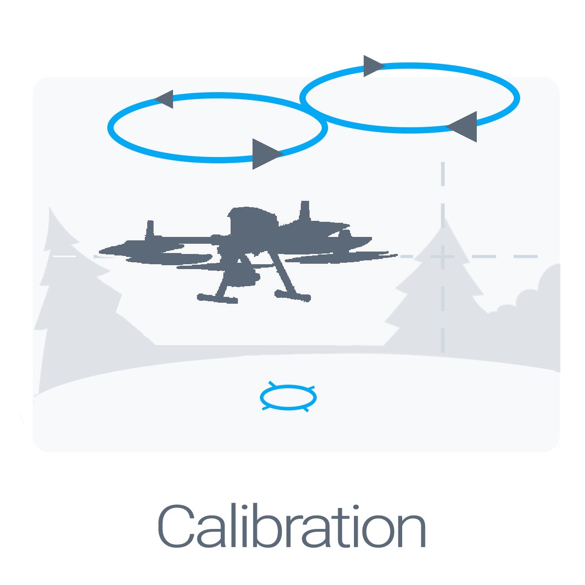

# Introduction

Welcome to your Rock Robotic R1a!

[{: style="width: 200px;"}](placing-the-base/settingup.md)
[{: style="width: 200px;"}](Calibration/Calibration.md)
[{: style="width: 200px;"}](mission-planning/mission-planning.md)

## Package Contents

In the box:

* 1 x Rock Robotic R1a LiDAR
* 1 x usb stick
* 1 x Hard case
* 1 x GNSS Antenna

## Getting Started

Please follow our [Quickstart Guide](quickstart/first-setup.md) to start collecting data quickly.

### Collaboration

This document can be edited on GitHub in markdown. If you find any mistakes, typos or  pieces that are not documented well enough simply open an issue or contribute by sending a pull request.

### Discussion

We are happy to answer any questions at [community.rockrobotic.com](http://community.rockrobotic.com).
