# Camera Boresighting

The LiDAR Payload– consists of a LiDAR, an INS, and a camera. In order to accurately create a colorized point cloud generated by the LiDAR and the camera, the camera must be accurately aligned with the Inertial Measurement Unit (IMU) of the INS. This is used to generate a georeferenced trajectory. Moreover, some of the camera calibration parameters must be edited to align the images with the point cloud. This alignment process is called “Boresighting” and is described in this manual. Boresighting is performed based on a scan of an area having a known structure.  This structure can be a pole or a building or a car. The scan can be done using a multi-copter drone. This document discusses drone camera boresighting.

## Camera Boresighting and Calibration

Before the boresighting pattern, the following convergence maneuvers must be performed to ensure good observability of IMU heading: 

1. Fly straight forward, for a duration of at least 5 seconds, at a speed of at least 5 m/sec
1. Left and right turns in motion, at least 90 degrees each
1. Boresighting pattern (2-3 figure-eights)
1. Left and right turns in motion, at least 90 degrees each
1. Fly straight forward, for a duration of at least 5 seconds, at a speed of at least 5 m/sec

Below is the trajectory of an example of a proper boresighting flight path. 

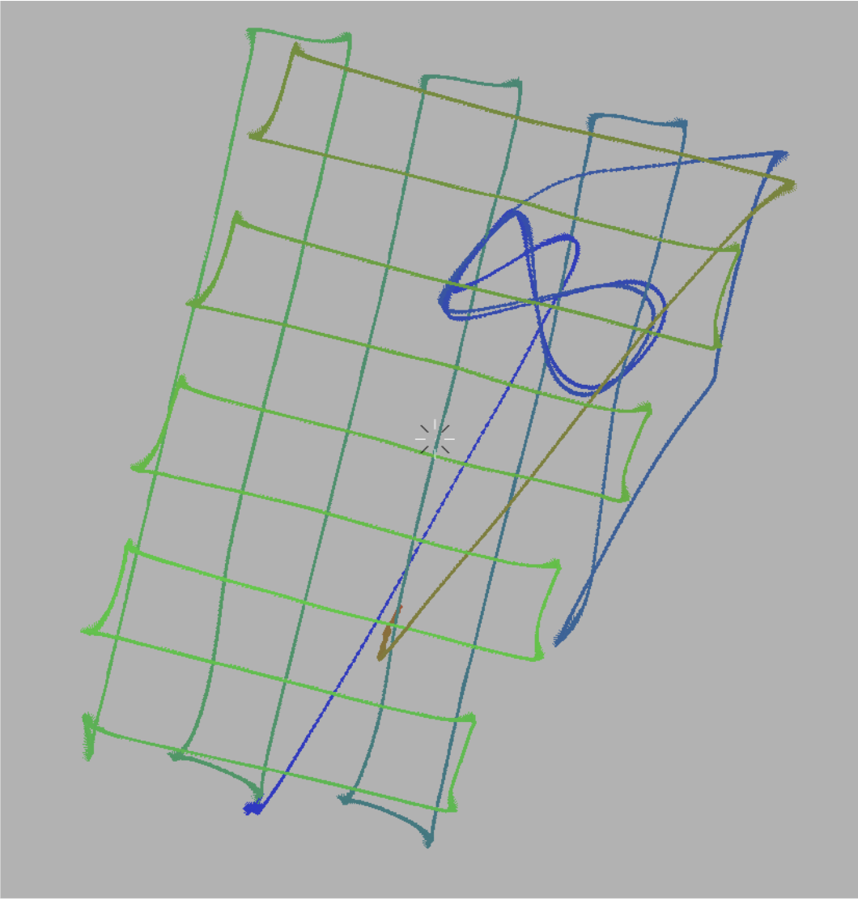{: style="width: 100%;margin:0 auto;display:block;"}

## Camera Image Alignment Parameters

All cameras have the following alignment parameters:

**Angular Offsets**

* Yaw offset between the IMU and the Camera
* Pitch offset between the IMU and the Camera
* Roll offset between the IMU and the Camera

**Camera Calibration**

* Focal Length
* Pixel flatness
* DistortNum
* DistortDen
* DeltaX
* DeltaY
* VignetteNum
* VignetteDen
* Red
* Green
* Blue
* Saturation

!!! warning "Note"
    Most camera calibration parameters do not need to be changed from their default values unless explicitly stated by the manufacturer. Parameters that are rarely changed will not be covered in the manual.

Each alignment parameter has its own unique effect on image positions in relation to a structure.

It is assumed that when all alignment parameters are correct, the image fits the size of the structure properly, and all the edges of the image align and match the edges of the structure.

In this manual, we will examine the effect of angular offsets and key camera calibration parameters on the image below.  The dark rectangle is the position and orientation of the camera in flight that was projected on to the point cloud. The white lines are provided as a frame of reference for when the manual is describing the effect of changing offsets on the position of the image.

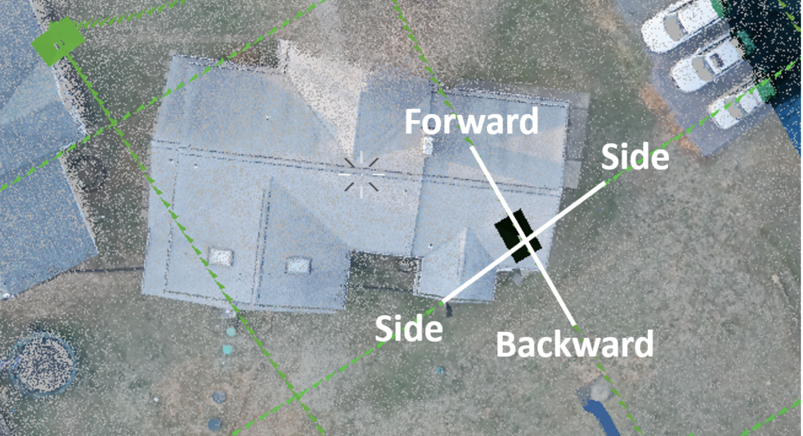{: style="width: 100%;margin:0 auto;display:block;"}

When using a structure like a house for camera boresighting, the most important areas to note are apexes of the roof as well as the edges of the roof.

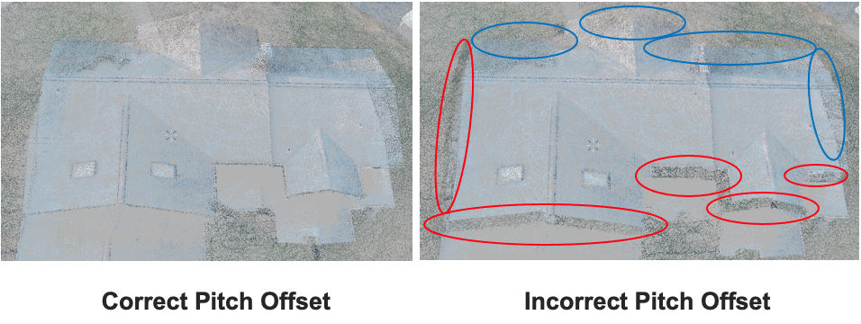{: style="width: 100%;margin:0 auto;display:block;"}

The pitch offset effects the displacement of the image in the side-to-side direction. This is indicated by the edges of the building beginning to take the color of the grass beneath it. These edges are circled in red. As a result, the coloring of the building spills into the grass on the areas circled in blue.

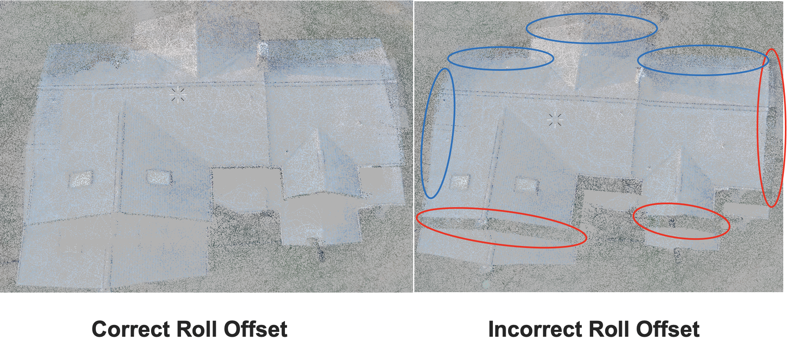{: style="width: 100%;margin:0 auto;display:block;"}

The roll offset of the camera effects the movement of the image in the forward and backward direction. This is evident by the shift in colorization in the images. With incorrect roll offset, the house takes on the color of the grass at the near edge of the roof and the right edge of the roof from this point of view. In addition, the colorization of the far edge and left edge of the roof begins to spill into the grass.

The yaw offset will cause the image to rotate. In this example, the goal is align the edges of the image with the edges of the roof and the sets of two dark lines with the ridges of the roof. Below is an extreme example of yaw misalignment.

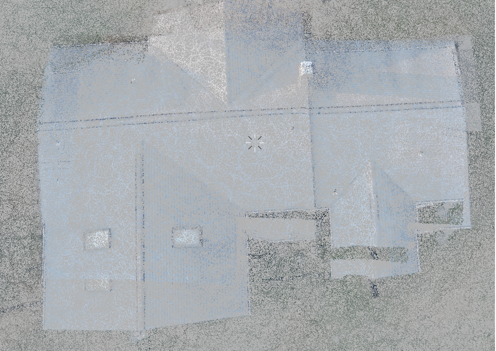{: style="width: 100%;margin:0 auto;display:block;"}

It is evident that the image is extremely rotated in the counterclockwise direction. This example is purely to show the effect of yaw offset on the image projection over the cloud. Such an extreme inaccuracy in yaw offset is quite unlikely and users will rarely encounter a situation like this. To see the effect of smaller yaw offset inaccuracies, we will use more zoomed in images focused the ridges of the roof. 

Below is the effect of yaw offset the largest ridge of the roof which ran horizontally in the previous images.

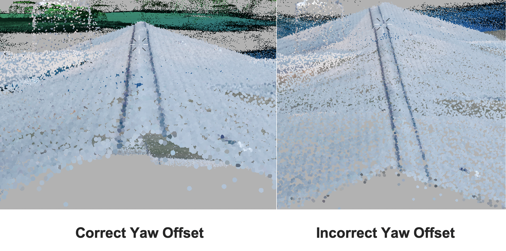{: style="width: 100%;margin:0 auto;display:block;"}

It takes a much smaller yaw offset to affect the colorization on the ridges of the roof. When using a building for camera boresighting, the ridges of the roof are a good place to check yaw offset accuracy. In this case, the yaw offset is correct when the dark lines on each side of the roof runs straight since it is previously known that this ridge is straight.

The last major parameter for camera boresighting is focal length. The focal length determines the size of the projected image. Below is a comparison of images with correct and incorrect focal lengths.

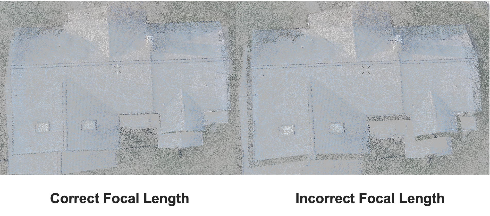{: style="width: 100%;margin:0 auto;display:block;"}

It is evident that the focal length changes the size of the image by the colorization of the image with the incorrect focal length. The edges of the roof have taken on the color of the grass, indicating that the image is too small.

## Checking Camera Boresighting

Once you are satisfied with the position and orientation of the image projected on the structure, there are a few ways to verify boresighting values.

One good way to verify boresighting is by looking at a power line, if possible, as shown below. When verifying a powerline, look for any distortion of the image or look for any incorrect colorization of the pole and the ground around the pole. These are both key indicators of misalignment. Below is an image detailing the difference between a well boresighted power line and one that is misaligned.

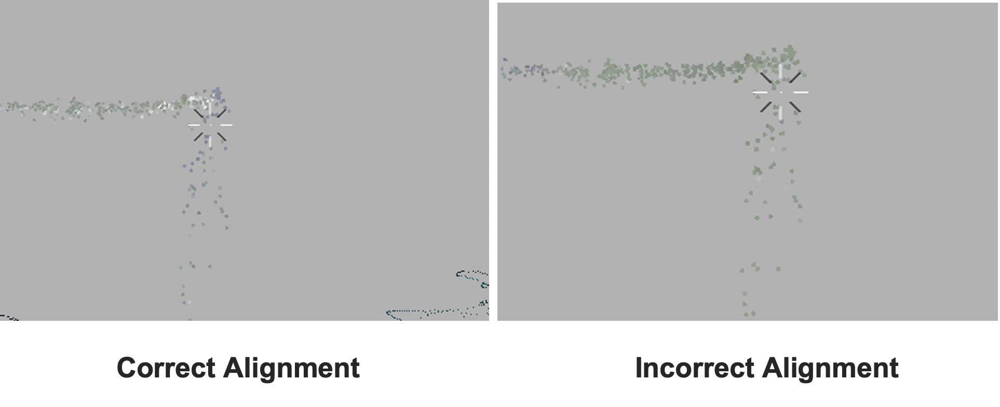{: style="width: 100%;margin:0 auto;display:block;"}

In this example, the pitch offset is misaligned. As a result, the colorization of powerline was projected over the pole instead of the powerline itself.

Another good way to check boresighting is to examine any cars within the point cloud. The windshields of cars do not reflect the lidar, so it is a good idea to see if the windshield lacks colorization and if any points around the car are incorrectly colored.  A comparison of correct and incorrect colorization of cars is shown below.

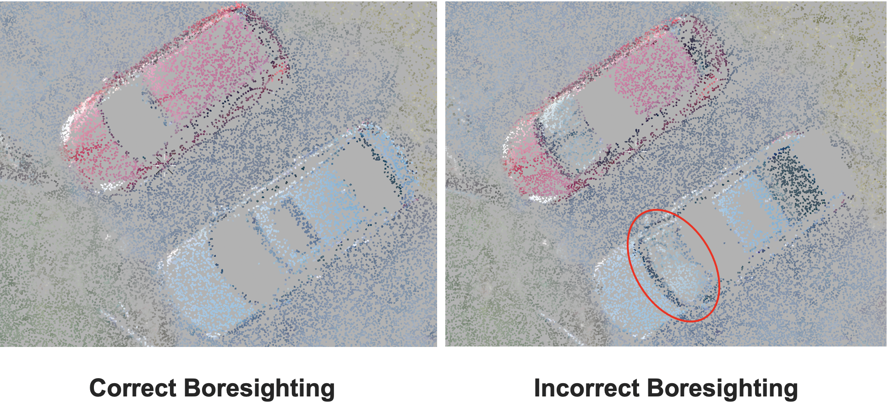{: style="width: 100%;margin:0 auto;display:block;"}

In this example, the incorrectly boresighted point cloud has an incorrect roll offset. This is indicated by the windshield of the car being colorized, as indicated by the red circle.

Lastly, a very good way to review boresighting is using a road. Using lines on a road is a good way to make sure that the camera boresighting values are accurate. In this example, we will examine the double yellow lines on a road. First, right click on a rectangle representing the camera position and orientation that will project an image on a road, and select “switch to camera here” as shown below. 

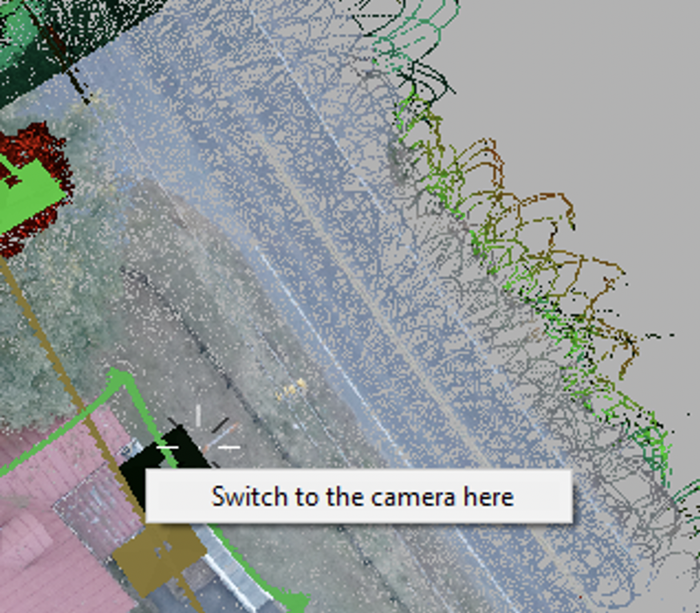{: style="width: 100%;margin:0 auto;display:block;"}

Then place the cursor on in between the lines depending on the road that is being used. In this scenario, we will place our cursor between the yellow lines as shown below.

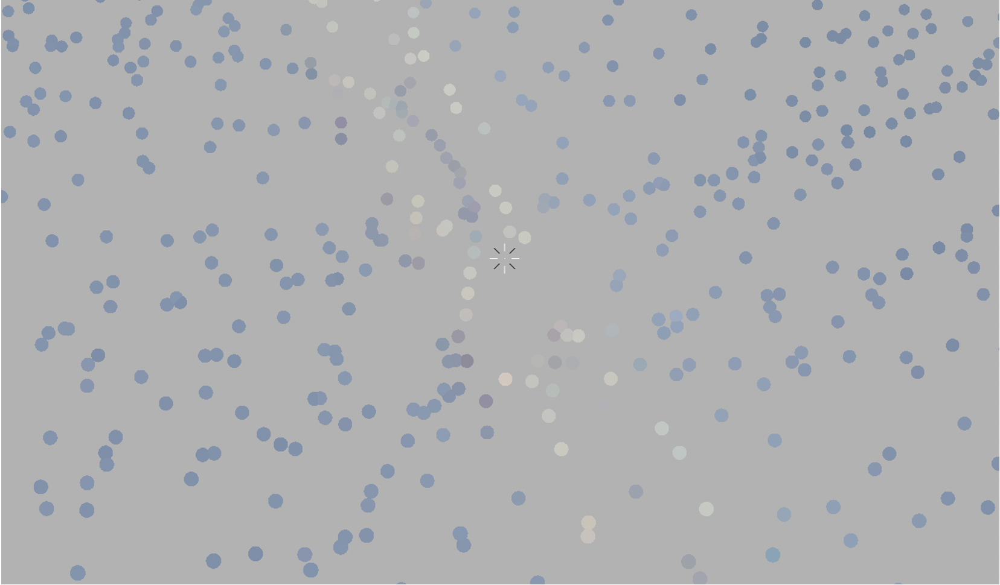{: style="width: 100%;margin:0 auto;display:block;"}

Zoom out from the point cloud without moving the cursor and then select a new camera orientation that will project an image on the road like shown.

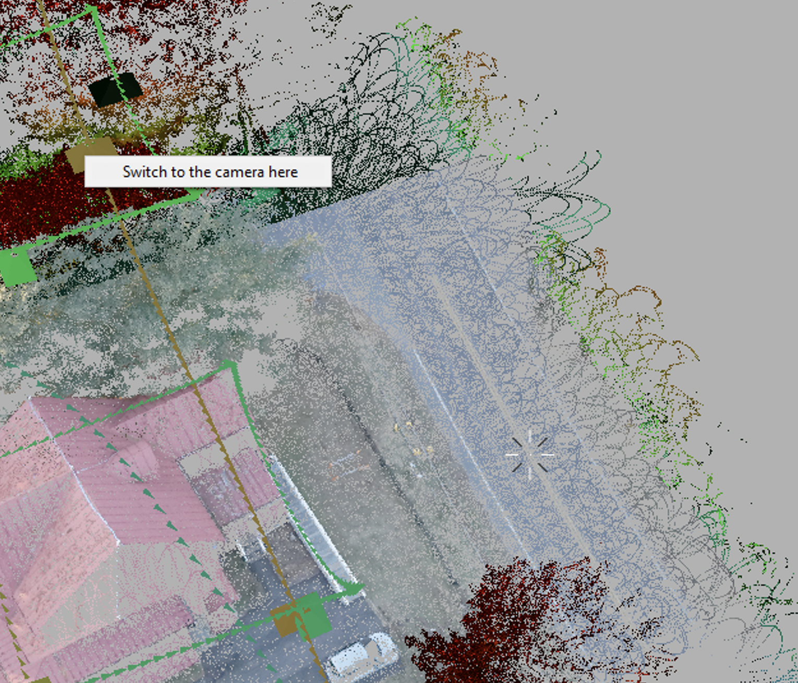{: style="width: 100%;margin:0 auto;display:block;"}

After the new image is selected, zoom in to where your cursor is. If the cursor is still on the same portion of the road as that on the previous image, then it is a good indicator that the camera boresighting is correct. In this example we see that the cursor is still directly between the two yellow lines, just like it was when the previous image was projected.

{: style="width: 100%;margin:0 auto;display:block;"}

## Storing the Computed Values

PCPainterGL, the software that is used for boresighting and camera calibration, saves the computed values in the PCPainter Project file. This file can be loaded onto the device using the web interface. After that, the values will be recorded in the camera image files on the device, and when those files are loaded in a newly created PCPainter Project, the values will also be automatically loaded there. To store the values, open the web interface and go to the Settings -> Camera page. Then, click “Read from PCPainter project” and browse for the PCPainter Project file. After the file is selected, the computer values will be extracted from the file and stored in the LiDAR Payload non-volatile memory.