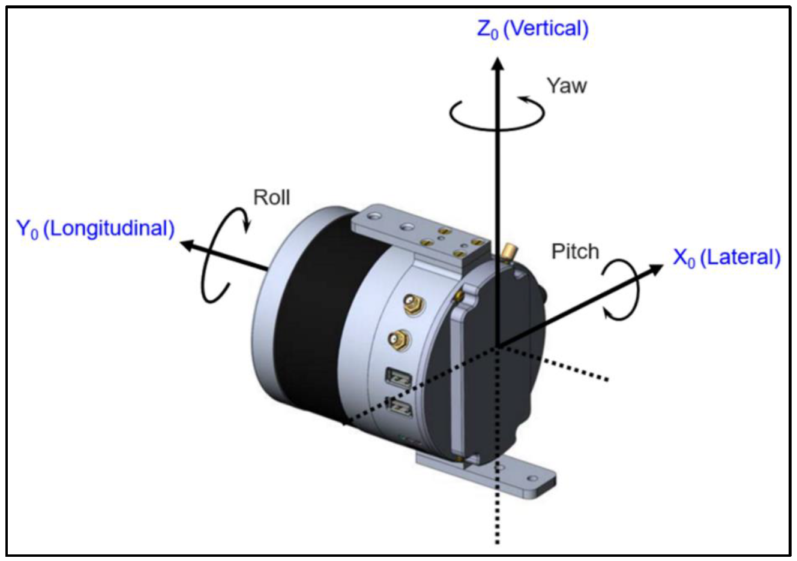
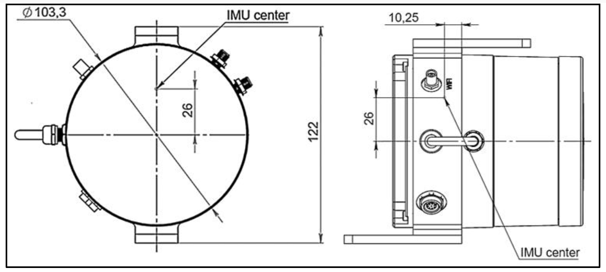
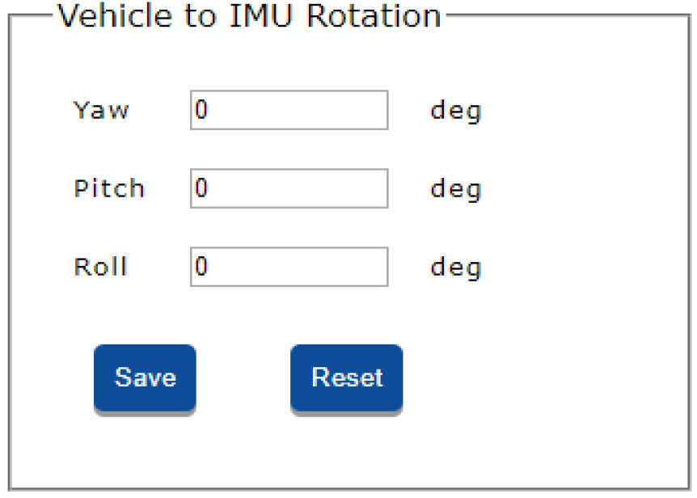
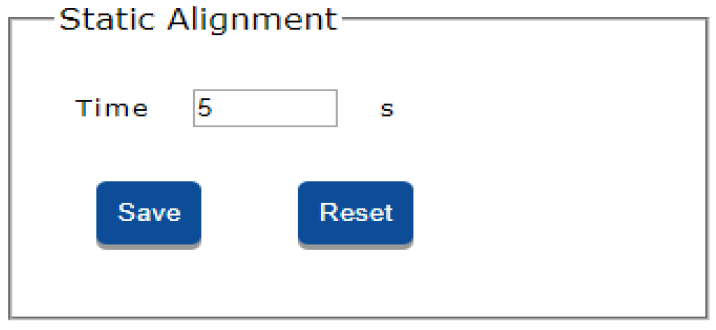

# Geometry Configuration

## IMU to Antenna Offset

In the “IMU to Antenna Offset” option enter the correct location of the antenna relative to the internal IMU using location of IMU center inside the LiDAR for measuring antenna offset.

{: style="width: 450px;margin:0 auto;display:block;"}

The orientation of the IMU within the LiDAR is shown below:

{: style="width: 450px;margin:0 auto;display:block;"}

"Right" refers to the "X" direction.

"Forward" refers to the "Y" direction.

"Up" refers to the "Z" direction.

The precise location of the IMU is depicted below in millimeters.

{: style="width: 450px;margin:0 auto;display:block;"}

## Vehicle to IMU Rotation

In the “Vehicle to IMU Rotation” option enter in the relative offset angles (axis misalignment; alignment angles) between the LiDAR and the carrier vehicle.

{: style="width: 450px;margin:0 auto;display:block;"}

Yaw, Pitch and Roll should all be measured with respect to the axes on the carrier object (i.e. – the measured Yaw value is measured relative to the front-end of the carrier object).

## Static Alignment

The “Static Alignment” option should be kept at 5 seconds (recommended) unless the carrier vehicle is unable to remain in a static position for this amount of time. When data-recording is started on the LiDAR, gyro biases will be estimated and used in data filtering processes.

{: style="width: 450px;margin:0 auto;display:block;"}
