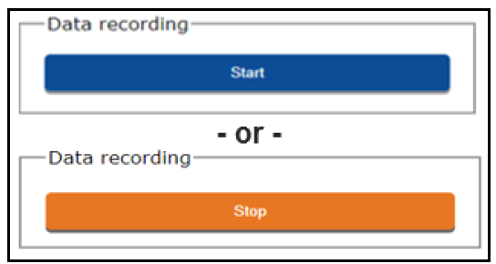
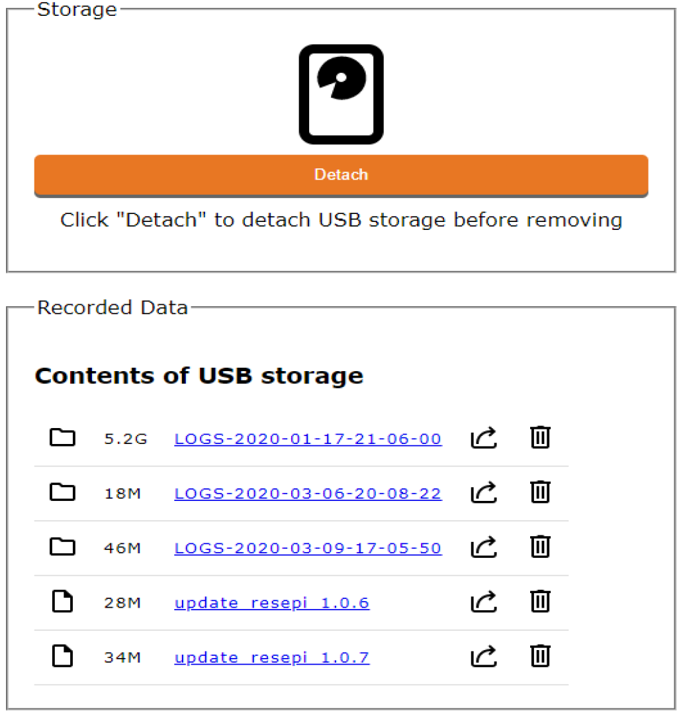

# Navigating the Web Interface

The navigation bar has three main menu options. “Status”, “Storage” and “Settings”. This section will discuss each menu window.

## Status Menu Window

Beginning at the top, the “Status” option shows the current status of the LiDAR.

{: style="width: 450px;margin:0 auto;display:block;"}

Below the “Status” option is the “Data recording” option. The user can toggle between Start and Stop.

{: style="width: 350px;margin:0 auto;display:block;"}

## Storage Menu Window

{: style="width: 450px;margin:0 auto;display:block;"}

The Storage Menu Window shows the contents of the USB storage device when it is connected to the LiDAR and the user has clicked “Re-attach”. At this time the user will have the ability to access, download, and view stored files on the USB memory stick.

The storage indicator at the top of the screen will be green if storage space is within normal range. It will turn yellow when storage is at 75% max capacity, and turn red when it is at 95% max capacity.

{: style="width: 450px;margin:0 auto;display:block;"}

You can download or erase data files by clicking on the download or trash icons.

{: style="width: 150px;margin:0 auto;display:block;"}

**Note:** It is recommended to remove the USB drive from LiDAR and plug it into the host computer instead of downloading files over Wi-Fi. This method is much faster because scan files are usually quite large.

## Settings Menu Window

To increase point cloud accuracy and configure specific settings for the LiDAR, use options from the Settings Menu Window. These settings are explained in more detail in the geometry settings section.

## Connectivity Tab Window

The “Connectivity” tab has two sections: “Wireless Network” and “RTCM Corrections”.

In the “Wireless Network” settings the user can configure the LiDAR to connect to an external WiFi network (only WPA/WPA2 Personal networks are currently supported). If the network is not configured or not in range, the LiDAR will broadcast its own unique WiFi network, so you can always connect to it.

## Firmware Tab Window

Rock Robotic may occasionally provide a firmware update for the LiDAR. Refer to the [Firmware Update](../lidar-details/firmware.md) page for more information.
