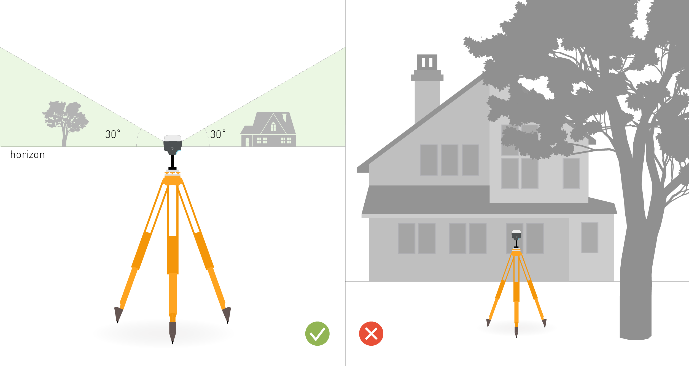

!!! tip ""
    A well-placed Reach base is essential for achieving good positioning results.

You can place your smartphone near the window in your house and it will obtain GNSS coordinates after some time, but for the ROCK Robotic LiDAR such environment won't be sufficient. For the R1A/R2A to work there are special requirements for placing the base.

### Clear sky view without any obstacles

The base station needs to have a clear sky view 30 degrees above the horizon. There should be no obstacles that could block the view like buildings, trees, cars, humans, laptops, etc.

Take a look at 2 pictures below. The left picture demonstrates desirable conditions for the base location. The right one is an example of bad surrounding conditions such as the reduced view of the sky, possible obstructions or vegetation nearby.

{: style="width: 100%;margin:0 auto;display:block;"}
 

Examples of **good** environments for base placement:

* field

* top of the hill

* rooftop

Examples of **bad** environments for base placement:

* indoors

* urban area

* forestry area

### No electronics nearby

Electronic devices may produce RF noise that could affect the reception of the GNSS signal. Keep all electronics as far as possible from the base and the LiDAR.

### Setting up the base

[Learn more about placing the base from the dedicated article in our docs.](../tutorials/Placing-the-Base.md)
