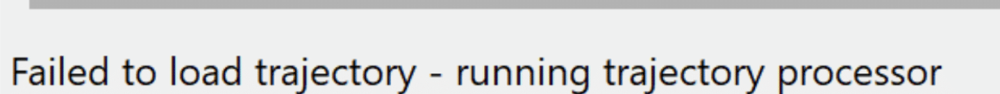
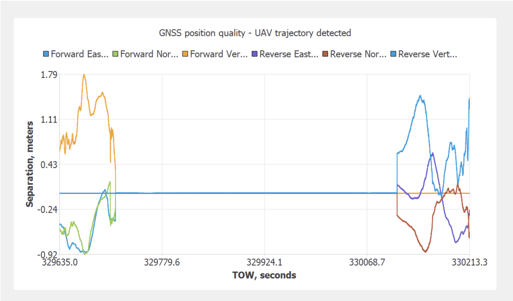
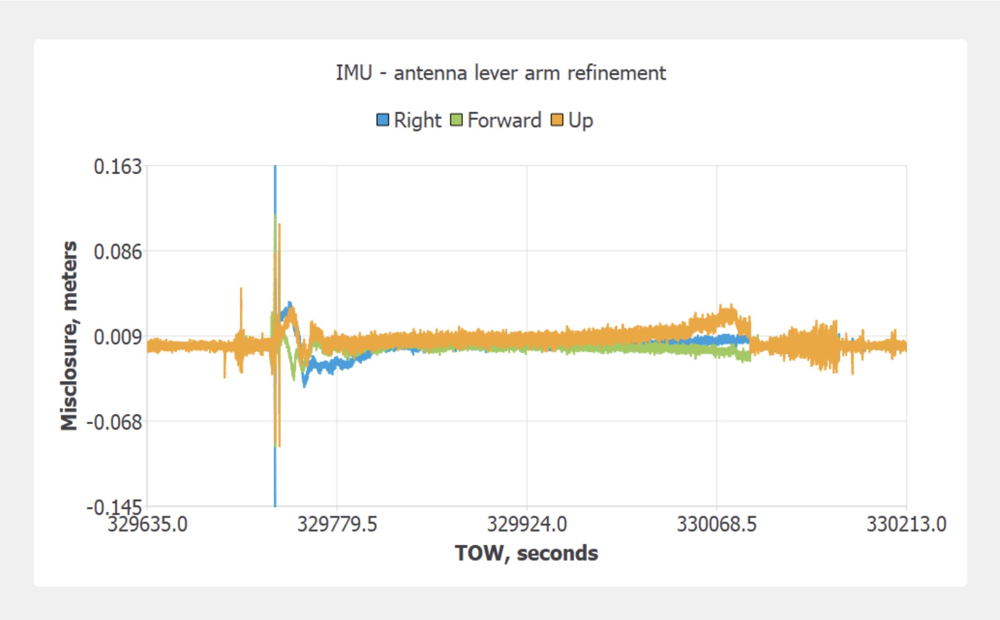
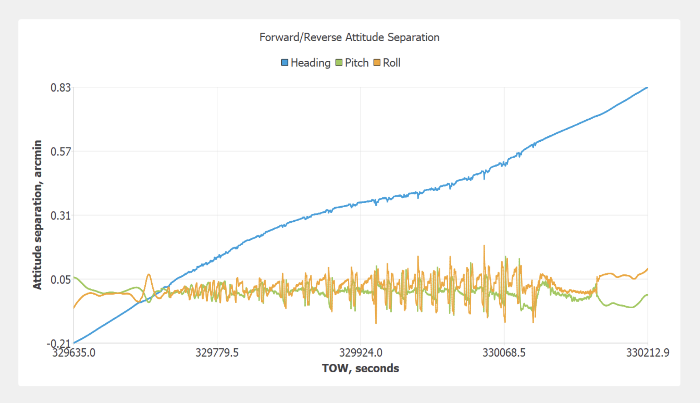

# Embedded Trajectory Processing

After activating the license, PCMasterGL is now capable of automated processing of inertial data. First, the user must manually add the base station RTCM or RINEX files from the time of the flight or drive to the “ins” folder of your project directory.

If RINEX files are used from an Emlid Reach RS2, be sure to place both the *.obs and *.nav files in the "ins" directory.

!!! danger "Make Sure"
    Do not process the data when it is still on the usb drive. It is too slow for processing. Transfer to your computer first.

Once this is added, simply open the PCMasterGL project named “ppk” within your project directory.

PCMasterGL will detect that the trajectory has not yet been refined and will automatically begin to run the trajectory processor. This will be indicated in the bottom left corner of the window like shown below.

{: style="width: 70%;margin:0 auto;display:block;"}

If PCMasterGL does not automatically detect your base station files you will receive the message “Base measurements file was not found – select the new one” at the top of the window. Simply select the aforementioned base station RTCM or RINEX (obs) file that was added to the “ins” folder and click “open”.

PCMasterGL will resample the base file and process the GNSS trajectory. The graph shown below plots the East, North, and Vertical separation of the forward and reverse trajectories. For aerial applications, it is expected to have a spike in separation during the takeoff and landing, and then become fixed during the flight.

{: style="width: 90%;margin:0 auto;display:block;"}

Then, it will begin to correct the antenna lever arm. This is done by processing the loosely coupled IMU-GNSS position misclosure. The misclosure plot will appear thinner after each iteration, indicating that the lever arm is more accurate.

{: style="width: 90%;margin:0 auto;display:block;"}

Lastly, the attitude separation is calculated for heading, pitch, and roll. This separation is representative of the difference between the forward and reverse processed trajectory values. The attitude separation is only problematic if it is above 4 arcminutes for heading and above 1 arcminute for pitch and roll. As seen below in this example, the attitude separation does not eclipse 1 arcminute for heading, pitch, and roll, indicating that the attitude separation is very good.

{: style="width: 90%;margin:0 auto;display:block;"}

Once the PPK trajectory is calculated, PCMasterGL will automatically begin to load the trajectory and lidar files and will populate the visualizer with the point cloud.

** Step 2 - [Create the pointcloud](point-cloud-processing.md#selecting-your-flight-lines) **