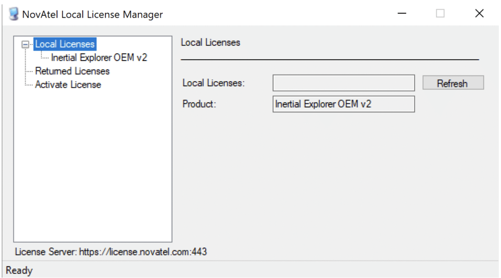

# Introduction

The ROCK Robotic R1A consists of a LiDAR and an INS. The data gathered from both devices must be fused together to get LiDAR points geo-referenced – transformed from the LiDAR reference frame to geographic coordinates.

The steps for taking the raw data and converting it to a point cloud are as follows:

1. Create a highly accurate trajectory
1. Use that trajectory to create the point cloud
1. (Optional) Colorize the point cloud with imagery.

## Platform Requirements

PCMasterGL works on Windows 10 x64 (MacOS and Linux x64 versions are in development). The key requirement for seamless visualization of large point clouds is a fast GPU with large video memory (dedicated or shared). The software has been tested on nVidia GeForce GTX graphics cards, but it is hardware independent. The rule of thumb is 1 GB of memory for every 15 million points in the cloud. The current software limit is 800 million points. Fast data processing also requires a fast CPU.

**Recommended computer specifications:**

* Intel Core i7 or better
* 32 GB RAM
* Nvidia GeForce GTX 1050 Ti or better
* Windows 10 x64

!!! danger "Make Sure"
    Do not process the data when it is still on the usb drive. It is too slow for processing. Transfer to your computer first.

## Activate "Embedded" Novatel License

PCMasterGL provides automated post processing powered by NovAtel Waypoint Inertial Explorer for users that purchased their LiDAR payload with the embedded Inertial Explorer license. In order to use this embedded feature you must ensure that you have PCMasterGL version >2.x. Additionally, before processing inertial data, you must activate your Inertial Explorer license through the NovAtel Local License Manager in the RockRobotic root folder.

The pathway to the Local License Manager should look similar to this:

C:\RockRobotic\PCMasterGL 

From there, open the application “LLMform” and the window shown below will
open.

{: style="width: 100%;margin:0 auto;display:block;"}

Then, select the tab “Activate License” on the left side of the window and input your license key to the field named “Activate License:”. Be sure to include the dash marks in the license key like shown in the example below.

**Example: xxxx-xxxx-xxxx-xxxx-xxx**

After this, select “Activate” and your license will be activated.

## Activate "Stand-alone" Novatel License

If you have a stand-alone Novatel License, then you will need to activate your license by following the [steps provided by Novatel](https://drive.google.com/file/d/1rht6fkXfudxcngIF1KCJbJ_-0jkjudtE/view?usp=sharing).

** Step 1 - [Create a highly accurate trajectory using "Embedded" Inertial Explorer](embedded-trajectory-processing.md) **

Or

** Step 1 - [Create a highly accurate trajectory using "Stand-alone" Inertial Explorer](trajectory-processing.md) **