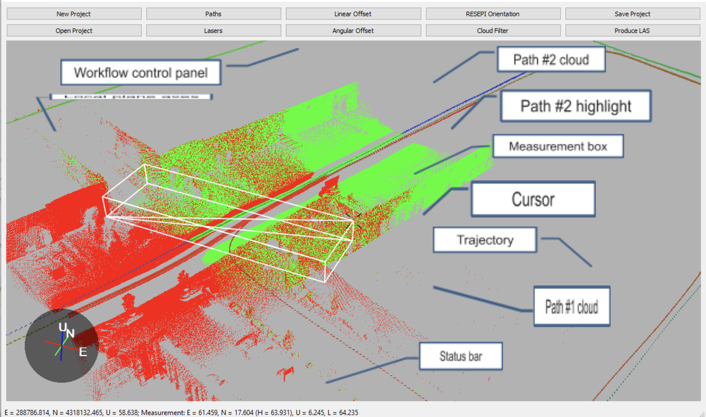

# Point Cloud Processing

The ROCK Robotic R1A consists of a LiDAR and an INS. The data gathered from both devices must be fused together to get LiDAR points geo-referenced – transformed from the LiDAR reference frame to geographic coordinates. The PCMasterGL software is designed just for that. Additionally, it observes and corrects for misalignments between the INS and the lasers of the LiDAR. PCMasterGL software takes INS trajectory generated by a Post-Processed Kinematics software and LiDAR scan files generated by R1A system and converts them to point clouds in LAS format for further processing. Two workflows are possible: full workflow for checking and adjusting misalignments; and quick workflow for cases when the system was previously calibrated, and the calibration data is stored on the R1A. The latter can be further sped up to batch workflow using a pre-defined project and zero user input.

## Platform Requirements

PCMasterGL works on Windows 10 x64 (MacOS and Linux x64 versions are in development). The key requirement for seamless visualization of large point clouds is a fast GPU with large video memory (dedicated or shared). The software has been tested on nVidia GeForce GTX graphics cards, but it is hardware independent. The rule of thumb is 1 GB of memory for every 15 million points in the cloud. The current software limit is 800 million points. Fast data processing also requires a fast CPU.

## Quick Workflow

Quick workflow is designed for fast LAS file production when the offsets and the calibration values are already stored in R1A.

- Click &quot; **New Project**&quot; and select the trajectory file and the scan files when asked. All scan files should be selected at the same time.
- **Right-click** at the blue end of the trajectory and select &quot; **Start selection here**&quot;.
- **Right-click** at the red end of the trajectory and select &quot; **Finish selection here**&quot;.
- Click &quot; **Cloud Filters**&quot; and adjust filters.
- Click &quot; **Produce LAS**&quot; and save the project when asked.

## Workflows

**Full workflow** is designed for scans where the misalignment angles are to be checked or adjusted. The workflow consists of the following steps:

* Trajectory loading
* Scan files loading
* Linear offset verification
* Calibration path selection according to guidelines outlined in R1A Boresighting Manual
* LiDAR boresighting using one laser
* Laser calibration for all other lasers
* Path selection for point cloud export
* Optional cloud filter configuration
* LAS export

**Quick workflow** is designed for scans where the misalignment angles are known. The workflow consists of the following steps:

* Trajectory loading
* Scan files loading
* Path selection for point cloud export
* Optional cloud filter configuration
* LAS export

When PCMasterGL is run in quick workflow mode with a pre-defined project file given as an argument, it takes all the necessary configuration values from the project file. It loads the trajectory and the scans, applies the stored calibration values, uses the filter configuration and path selection defined in the project and exports the LAS files without any user input. This can be referred to as “Batch workflow”.

## User Interface

PCMasterGL has a very simple user interface with a near zero learning curve. The main window is shown below.

{: style="width: 100%;margin:0 auto;display:block;"}

The main window shows:

* Workflow control panel with
	* buttons to perform actions on the current project, creating a new project, opening an existing one, saving it, changing filters and producing LAS files
	* button to toggle display of different path segments on and off
	* button to toggle display of different lasers on and off, and to adjust calibration of each laser
	* buttons to adjust offsets
* Status bar showing the local plane position of the cursor and the dimensions of the measurement box
* Main 3D view showing current trajectory, currently enabled path segments and their point clouds from currently enabled lasers, the local plane axes, the cursor focused on the current position and the measurement box if measurements are currently being taken

The main 3D view can be controlled with as few as two mouse buttons, two keyboard keys and the mouse wheel.

To look at the focus from different directions press and hold **Left mouse button** and move the mouse.

To rotate the camera around its axis, press and hold **Shift** and **Left mouse button** and move the mouse.

To move the focus horizontally, press and hold **Ctrl** and **Left mouse button** and move the mouse.

To move the focus up and down, press and hold **Ctrl, Shift and Left mouse button** and move the mouse.

To move the camera closer to the focus, scroll the **mouse wheel** forward.

To move the camera away from the focus, scroll the **mouse wheel** back.

To make perspective smaller (telephoto view) press and hold **Shift** and scroll the **mouse wheel forward**.

To make perspective wider (wide-angle view) press and hold **Shift** and scroll the *mouse wheel back*.

These field of view changes are useful when a long plane is looked at from its side. When the camera is in the telephoto mode, all parts of the plane have the same visible thickness with no perspective. This is very useful for laser calibration and offset adjustment. In this mode trackball rotations are also slowed down for fine adjustments.

**Right mouse button** – when it is clicked, it opens the context menu with actions:

* Start, restart, or finish new path segment selection at the point where the mouse is now;
* Start, restart measurement at the current focus point or stop measurement;
* Switch point cloud coloring between by-segment and by-laser.

Mouse buttons and wheel work the same way on touchpads, including multi-touch ones with mouse wheel modeled by zoom-in multi-touch pattern.

## Workflow Control Panel

Workflow control buttons are:

- **New Project** – clears the current data if any and asks for the new trajectory and new scan files. New data are loaded, and the trajectory is displayed. Calibration values and offsets are taken from the R1A scan files; filters are cleared.
- **Open Project** – clears the current data and loads the trajectory and the scans from the selected project. The paths and the lasers are selected for display and export as specified in the project. Calibration values, offsets, and filters are loaded from the project file as well.
- **Paths** – opens the list of currently selected trajectory segments with their display colors. Each can be checked and unchecked for display and for export, and each can be removed using the **Remove** action button.
- **Lasers** – opens the list of lasers in the scan files and their calibration values. Each can be checked and unchecked for display or export, and each calibration value can be adjusted. Adjusted values are immediately applied to the point clouds in the main view.
- **Linear Offset** – opens the panel showing the linear offset of the LiDAR reference point from the IMU reference point in the R1A reference frame. The changes immediately apply to the cloud.
- **Angular Offset** – opens the panel showing the alignment between the LiDAR and the R1A reference frame. The changes immediately apply to the cloud.
- **R1A Orientation** – opens the panel showing the R1A orientation in the vehicle reference frame. This should match the orientation entered in the R1A settings; it is recorded in the scan files and should not normally be changed unless the orientation was set incorrectly by mistake and had to be corrected in the trajectory generation software.
- **Cloud Filter** – opens the panel where filters can be enabled and configured. The filters are discussed in the next section. Changes in the configuration apply immediately to the cloud.
- **Save Project** – saves the current state of the project to a project file.
- **Produce LAS** – produces the LAS file for every selected path checked for export, using points from every laser checked for export. Points are filtered through currently enabled filters. Project is automatically saved before production. The LAS files are saved in the &quot;clouds&quot; sub-folder in the folder where the project file is saved.

## Cloud Filters

Cloud filters allow users to clean up the point cloud by eliminating points produced by reflections and some distortion points caused by high angular rates of the vehicle.

The filters are:

- **Rotation angle** filter restricts the cloud to points obtained from lidar when its reported rotation angle is between the minimum and the maximum value. For example, when a UAV flies above the ground, only points from the sector below the UAV make sense. Thus, the range can be limited to some 120-150 degrees around the nadir. If the range around 360 degrees is desired, the left value should be set larger than the right value. That way, the range will be limited from the left value to 360 degrees plus from 0 degrees to the right value.
- **Distance** filter restricts the cloud to points within a certain distance range from the LiDAR in meters. This is useful for filtering out reflections from the car roof by setting the left value to some 2 meters and the right to some insanely large value.
- **Reflectivity** filter restricts the clouds to points within certain reflectivity range.
- **Angular rate** filter restricts the clouds to points taken when the R1A was turning slower than the set value in degrees per second.
- **Easting, Northing,** and **Altitude** filters simply reject points that are outside the set boundaries in meters.

## Full Workflow

In full workflow, designed for laser calibration and boresighting, the steps are:

- Click &quot; **New Project**&quot; – select the trajectory file and the scan files when asked. All scan files should be selected at the same time.
- PCMasterGL will load the data and pre-process scan files. It will also load the R1A orientation, the offsets and laser calibration values that were stored on R1A. The trajectory will be displayed, colored from blue at the beginning, to red at the end.
- Verify **R1A orientation** and that it matches the actual orientation of the unit during the scan. It should most likely match.
- Verify **Linear offset** and that it matches the reference values provided by the manufacturer.
- Find a place in the trajectory where calibration values can be observed, per R1A Boresighting Manual.
- Select the paths in the opposite directions in both legs of the boresighting pattern as separate segments:
  - **Right-click** on the beginning of the trajectory segment and select &quot; **Start selection here**&quot;.
  - If the position is incorrect, **Right-click** on the correct position and select &quot; **Restart selection here**&quot;.
  - **Right-click** on the other end of the trajectory segment and select &quot; **Finish selection here**&quot;. PCMasterGL will highlight the selected segment and display the point cloud obtained for this segment, colored the same as the segment highlight.
  - Repeat these steps for the other three segments of the boresighting path.
  - Click the &quot; **Lasers**&quot; button and select the reference laser to adjust angular offsets. It should be a laser producing tilted lines. Depending on the R1A orientation, it can be laser 0, or laser 1, or laser 15 (for VLP-16 LiDAR). Ensure the &quot; **Azimuth**&quot; value is zero for the reference laser. Uncheck &quot; **Display**&quot; for all other lasers. The point clouds will only show the selected laser then.
  - Click the &quot; **Paths**&quot;button and select the two path segments going in the opposite directions, say East and West, for example. Uncheck &quot; **Display**&quot;for all other paths. PCMasterGL will only display the selected paths.
  - Turn the view in such a way so it looks along the bottom edge of the vertical wall. Observe the vertical mismatch between the path clouds.
  - Click &quot; **Angular Offset**&quot; and adjust the **Roll** offset while observing the clouds moving. Use **PgUp** or **PgDn** to change the value by 0.1 degree and **Up** or **Down** to change by 0.01 degree. _Hint:_ The offset window can be moved away from the main window and kept open while doing other adjustments. _Another hint:_ Use the **mouse wheel** with **Shift** to get the telephoto view with no perspective for better observability of mismatch.
  - Rotate the view to look along the vertical edge, open the &quot; **Lasers**&quot; window and adjust the &quot; **Elevation**&quot; offset of the reference laser to align the vertical edges. The wall planes may be misaligned because of the Yaw offset of the LiDAR, which will be adjusted later. _Hint:_ the laser controls window can be kept open while adjusting other values as well.
  - If the wall edges are aligned at the bottom but not aligned at the top, adjust the &quot; **Pitch**&quot; offset to align them.
  - Select the other two paths and align all four vertical edges by adjusting the &quot; **Yaw**&quot; offset.
  - Select other lasers one by one and adjust their &quot; **Azimuth**&quot;offsets, aligning the horizontal edges; and their &quot; **Elevation**&quot; offsets, aligning the vertical edges of the same wall.
  - Verify the quality of calibration by selecting all lasers together and verifying that all clouds are aligned.

Now the calibration segments can be removed by clicking &quot; **Delete**&quot; for each of them in the **Path controls** window. Then the full trajectory can be selected for LAS file export as in the next section for Quick workflow.

Also, the project can be saved using &quot; **Save Project**&quot; and imported into R1A for storing the offsets and the calibration values.

## Batch Processing

PCMasterGL can work with pre-created project files, where all the necessary values are already set. All it takes then is one button to produce a LAS file. It can even be scripted if PCMasterGL is run with the project file for argument and the &quot;batch&quot; option. In that case, 3DView is not even shown, only the LAS files are produced based on the project file contents. PCMaster Project file format (PCMP) is simple XML with self-explanatory structure shown below and can be edited or generated by a script. Path selection is measured in tenths of a second and can be set to 0 for start and an insanely large number like 2,000,000,000 for finish to select the whole trajectory.

## PCMasterCL – Command Line Interface

Versions of PCMasterGL after (and including) PCMasterGL version 1.5.2.1 by default include the ability to generate point clouds from the command line.

After a project file has been created, the same project can be used to generate future clouds with the same configured settings using the command line which is much faster than directly using the graphical user interface.

To do this, start by creating a project in PCMasterGL and configure the settings you would like to be applied for current and future clouds that will be generated.

Save this project file to a location of your choice and right-click the project file and select &quot;Process&quot; to begin cloud generation from the command line.

To run a particular project file from the command line simply use the following command:

_C:\ (location of PCMasterGL.exe)\&gt;_ _PCMasterCL.exe \&lt;path to the project file\&gt;_

** Step 3 - [Pointcloud Colorizing](colorizing.md) **
