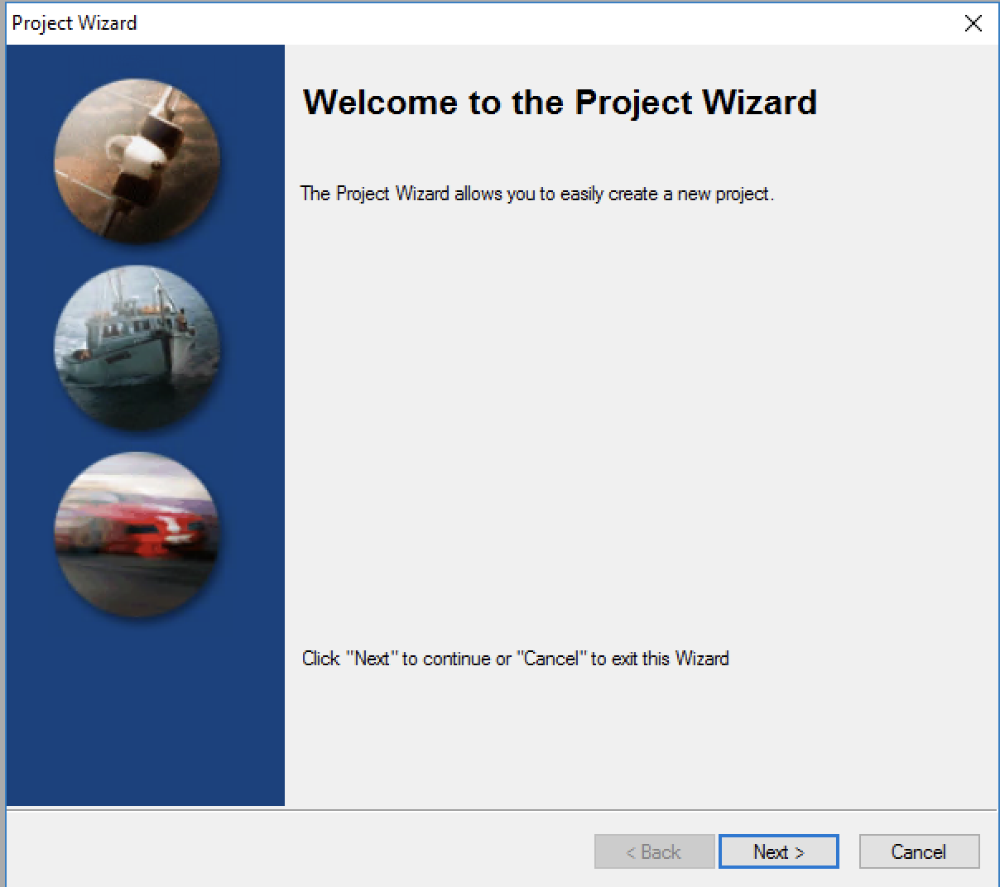

# Trajectory Processing

In order to have a highly accurate point cloud the exact position of the LiDAR unit must be calculated. Inertial Explorer is used to create this highly accurate position file.

## Prerequisits

1. Inertial Explorer installed on your computer
1. Data from an R1A LiDAR scan
1. A base station RINEX file
1. The precise position of the base station

## Install Inertial Explorer User Settings

After Inertial Explorer is installed for the first time you will need to apply some user settings.

<a id="raw-url" href="https://raw.githubusercontent.com/RockRobotic/rock-doc/master/docs/pre-processing/files/R1A_IE_Profiles.zip">Download configuration files</a>

Unzip and place these configuration files inside `C:\NovAtel\InertialExplorer890\resources\User`

## Process Trajectory

Start Inertial Explorer

Select File -> New Project -> Project Wizard

Welcome to the Project Wizard (click 'Next')

{: style="width: 80%;margin:0 auto;display:block;"}

Browse and select the 'Rover' data. This data will be found in the ROCK* folder on the R1A thumbdrive. The file will end with *-gnss.gps
Select the checkbox 'I have IMU data file in Waypoint (IMR) format'.
Browse and select the *-imu.imr file inside the ROCK* folder.

{: style="width: 80%;margin:0 auto;display:block;"}

Click 'Next'

Remote (Rover) Antenna Height -- Do not change settings, simply click 'Next'

Base (Master) Stations -- Select 'Add Station from File' -> 'Next'

{: style="width: 80%;margin:0 auto;display:block;"}

Browse and select the *.obs RINEX file that you recorded from your base station.

{: style="width: 80%;margin:0 auto;display:block;"}

**Base (Master) Station Information**

Enter the precise coordinates of the base station.
Enter the precise height of the base station antenna above the ground in 'Measured height'.
NOTE: This is the height of the tripod plus the height from the bottom of your receiver to the antenna. Your GNSS receiver manufacturer will tell you the height from the bottom of the receiver to the antenna. For instance, the EMLID Reach RS2 is .134 meters.

Then click 'Next'

{: style="width: 80%;margin:0 auto;display:block;"}

**Base (Master) Stations**

Click 'Next'

{: style="width: 80%;margin:0 auto;display:block;"}

**Project Overview**

Click 'Finish'

{: style="width: 80%;margin:0 auto;display:block;"}

** Unprocessed Map**

You will now see the unprocessed trajectory like this:

{: style="width: 80%;margin:0 auto;display:block;"}

**Process TC (Tightly Coupled)**

Select Process -> Process TC (Tightly Coupled)

{: style="width: 300px;margin:0 auto;display:block;"}

In Processing Settings select:

1. Processing Direction 'Both' and Multi-pass
1. 'IL INS (UAV)' profile
1. De-select 'Read rotations and lever arms from IMR file'

The first time processing data with the R1A on a particular drone, you need to 'Solve lever arm'

Click the down arrow next to 'Process' and select 'Solve lever arm'

{: style="width: 80%;margin:0 auto;display:block;"}

This will determine the X, Y, Z offset for the gnss antenna to the IMU. You will want to 'Solve lever arm' multiple times. Between each run select the 'Average' and run again. 

{: style="width: 80%;margin:0 auto;display:block;"}

After 3 or 4 times the lever arm will converge and you will know the lever arm.

Once the lever arm is determined, you can create a vehicle profile so you wont have to calculate the lever arm again.

Now click 'Process'

If pre-processing checks pop up, select 'Try to fix the issue(s) before processing' -> Continue

{: style="width: 80%;margin:0 auto;display:block;"}

**Export Wizard**

Once processing is complete select 'Output' -> 'Export Wizard'

{: style="width: 300px;margin:0 auto;display:block;"}

Name the exported file and select PCMasterGL in the profile -> Next

!!! warning "File name and Location"
    In order for the next processing steps to work smoothly, ensure you place the exported file in the pre-created 'ins' directory and name the file 'ppk.txt'.
    It should look like this `ROCK-XXXX-[DATE]/ins/ppk.txt`

{: style="width: 80%;margin:0 auto;display:block;"}

Select 'Use processing datum' -> Next

{: style="width: 80%;margin:0 auto;display:block;"}

IMU Epoch Settings -> Finish

{: style="width: 80%;margin:0 auto;display:block;"}

You will now have a highly refined trajectory file that you can use with PCMasterGL.

** Step 2 - [Create the pointcloud](point-cloud-processing.md) **