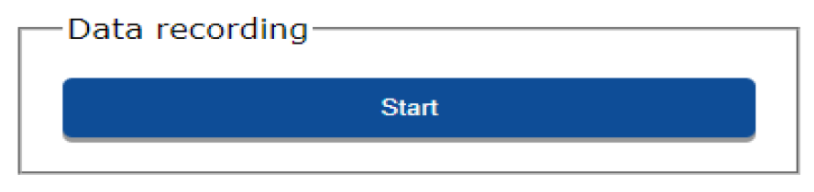
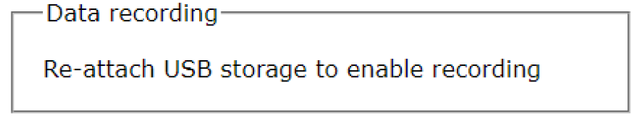

# First Setup

## Intro

In this tutorial, we will walk you through the following steps:

* Attach the LiDAR to your vehicle
* Power on and connect to the LiDAR
* Configure the LiDAR
* Setup your base station
* Calibrate the LiDAR
* Collect data
* Retrieve data for processing

To do this, you will need Rock LiDAR itself, a smartphone or PC, and the vehicle.

## Attach the LiDAR to your vehicle

The LiDAR can be attached to any number of vehicles in order to acquire LiDAR data. In this quickstart we will assume you are attaching the LiDAR to a drone. If you are attaching to another vehicle please refer to our [Community](https://community.rockrobotic.com) for additional help.

Refer to the setup guide for your particular drone to connect the LiDAR.

* [DJI Matrice 300 RTK](../drone-setup/m300.md)
* [DJI Matrice 210](../drone-setup/m210.md)
* [DJI Matrice 600](../drone-setup/m600.md)
* [Freefly Alta-X](../drone-setup/alta-x.md)
* [Other Drone System](../drone-setup/other.md)

## Power on and Connecting to the LiDAR

!!! danger "Make Sure"
    Be sure to use the supplied usb drive. [Only specific usb drive specifications will work.](../lidar-details/usb.md)

First, ensure the supplied usb drive is inserted into the LiDAR. Then, power on the LiDAR. After powering up the unit, open Wi-Fi settings on your host computer (tablet, smartphone, or PC) and look for the wireless network labeled:

!!! tip "Tip"
    See [Full Flight without using GUI](../tutorials/flight-no-gui.md) for an even faster setup.

`ROCKrobotic-######`

Connect to this network using the following password:

`rocklidar`

Next, open up the web browser of your choice and go to the following web address:

`192.168.12.1`

{: style="width: 450px;margin:0 auto;display:block;"}

## Configure the LiDAR

In order to obtain as accurate as possible data from the LiDAR, the unit needs to be configured for the data acquisition vehicle. [See Geometry Configuration for details](../lidar-details/geometry-configuration.md). If using the LiDAR as designed and shipped from Rock Robotic, then this information will already be configured. If you are using a custom configuration, refer to the [Community](https://community.rockrobotic.com) for additional help.

## Setup your Base Station

A highly accurate trajectory is necessary for accurate results from the LiDAR. In order to obtain this accurate trajectory you must use a GNSS base station. We recommend the [Emlid Reach RS2](https://store.emlid.com/?ref=40). Follow the [Placing the Base](../tutorials/Placing-the-Base.md) for setting up your base station.

The base station should be configured to log Raw data in RINEX 3.03+ format for the entire duration of the LiDAR data acquisition.

## Collect Data

When you are ready to start collecting data click the 'Start' button within the web interface.

{: style="width: 300px;margin:0 auto;display:block;"}

The LiDAR, IMU, and GPS will all start collecting data. Proceed with your planned mission!

**Note:** To protect the user from accidently attempting to record data while the USB is unattached, the user does not have the ability to “Start” data recording in the “Status” window when the USB is unattached. When unattached the user will see the message shown below in Fig. 2-8. Message displayed when trying to record data while USB is unattached.

{: style="width: 250px;margin:0 auto;display:block;"}

## Take Flight

See the [complete steps](../../Calibration/Take-flight) for taking off, calibrating, flying your mission, and landing.
