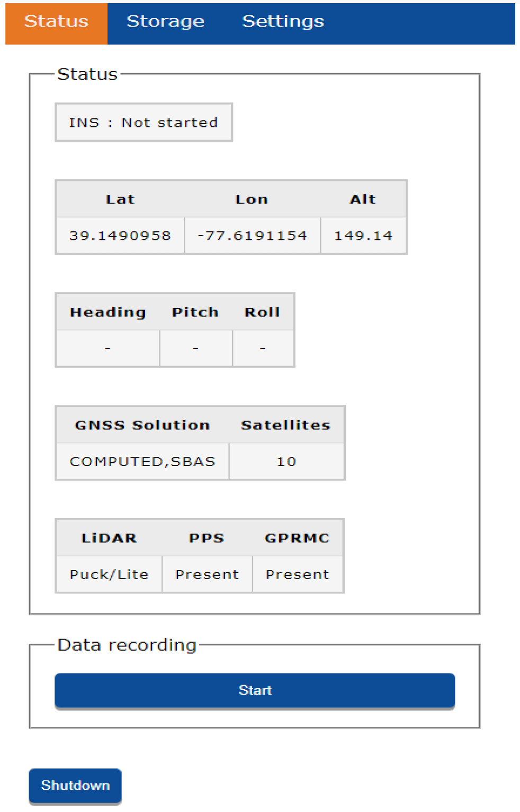

# First Setup

## Intro

In this tutorial, we will walk you through the following steps:

* Attach the R1a to your vehicle
* Power on and connect to the R1a
* Configure the R1a
* Setup your base station
* Calibrate the R1a
* Collect data
* Retrieve data for processing

To do this, you will need Rock R1a itself, a smartphone or PC, and the vehicle.

## Attach the R1a to your vehicle

The R1a can be attached to any number of vehicles in order to acquire LiDAR data. In this quickstart we will assume you are attaching the LiDAR to a drone. If you are attaching to another vehicle please refer to our [Community](https://community.rockrobotic.com) for additional help.

Refer to the setup guide for your particular drone to connect the R1a.

* [DJI Matrice 300 RTK](../drone-setup/m300.md)
* [DJI Matrice 210](../drone-setup/m210.md)
* [DJI Matrice 600](../drone-setup/m600.md)

## Power on and Connecting to the R1a

!!! danger "Make Sure"
    Be sure to use the supplied usb drive. [Only specific usb drive specifications will work.](https://www.amazon.com/gp/product/B07BPKKTGL)

First, ensure the supplied usb drive is inserted into the R1a. Then, power on the R1a. After powering up the unit, open Wi-Fi settings on your host computer (tablet, smartphone, or PC) and look for the wireless network labeled:

`ROCKrobotic-######`

Connect to this network using the following password:

`LidarAndINS`

Next, open up the web browser of your choice and go to the following web address:

`192.168.12.1`

{: style="width: 450px;margin:0 auto;display:block;"}

## Configure the R1a

In order to obtain as accurate as possible LiDAR data from the R1a, the unit needs to be configured for the data acquisition vehicle. This includes the "IMU to Antenna Offset" and the "Vehicle to IMU Rotation". If using one of the provided setup kits, the information will be provided for you. If you are using another acquisition vehicle refer to the [Community](https://community.rockrobotic.com) for additional help.

## Setup your Base Station

A highly accurate trajectory is necessary for accurate results from the R1a. In order to obtain this accurate trajectory you must use a GNSS base station. We recommend the [Emlid Reach RS2](https://store.emlid.com/?ref=40). Follow the [RS2 documentation](https://docs.emlid.com/reachrs2/) for setting up your base station.

The base station should be configured to log Raw data in RINEX 3.03+ format for the entire duration of the R1a data acquisition.

## Calibrate the R1a

After turning on the R1a be sure to let the R1a sit in a static position for at least 5 seconds. Before turning on the LiDAR, you will need to fly a figure 8 pattern three times to ensure the IMU is calibrated. Once calibration is complete, land the drone.

## Collect Data

When you are ready to start collecting data click the 'Start' button within the web interface.

{: style="width: 300px;margin:0 auto;display:block;"}

The LiDAR, IMU, and GPS will all start collecting data. Proceed with your planned mission!

**Note:** To protect the user from accidently attempting to record data while the USB is unattached, the user does not have the ability to “Start” data recording in the “Status” window when the USB is unattached. When unattached the user will see the message shown below in Fig. 2-8. Message displayed when trying to record data while USB is unattached.

{: style="width: 250px;margin:0 auto;display:block;"}

At the completion of the mission you will need to fly three additional figure 8 patterns with the drone and then land. Once on the ground let the drone sit for five minutes before stopping the data collection and powering off the unit.

Congratulations! You collected your first LiDAR data!

## Retrieve Data for Processing

All of the LiDAR, IMU, and GPS data is written to the usb stick which is attached to the R1a. When the unit is powered off you can detach the usb and insert into your PC to begin your processing.
