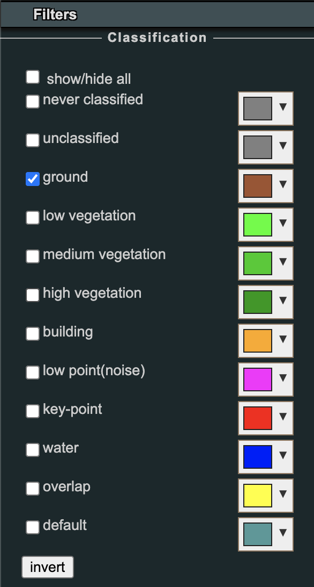
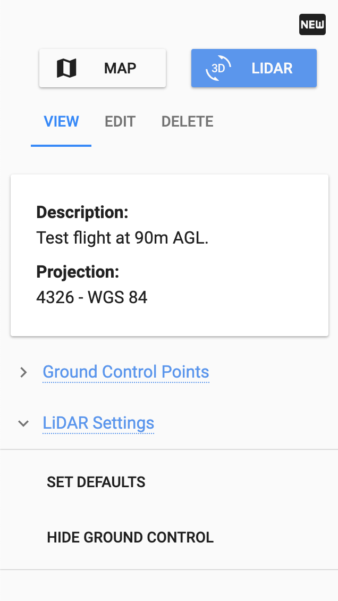

# Deliverables

Depending on the selections made during the processing step your data deliverables will change. However, all data processed will result in a 3D pointcloud which can be viewed and analyzed in our Rock Cloud Data Visualizer.

## Data Visualizer

The Rock Cloud has a powerful data visualizer built right in. There are hundreds of different ways to view and analyze your data using our data visualizer. Below are just a few of the most popular.

### Elevation and Intensity View

Open the Rock Visualizer menu and click Scene --> Select 'Project' in the object tree --> Change the 'Attribute' selection to 'elevation' or 'intensity'.

### Display Ground Only

Open the Rock Visualizer menu and click 'Filters' --> Select only 'ground' classification.

### Annotate

The Project owner is able to place annotations on the point cloud and set the default view for the point cloud.

Open the Rock Visualizer menu and click Tools --> Select the Annotation icon .

Once selected you can click on the point cloud to place the annotation pin. Scroll down in the sidebar to change the properties of the title and description. To save the annotations and the default camera view, select the 'Set Default' link in the sidebar.

