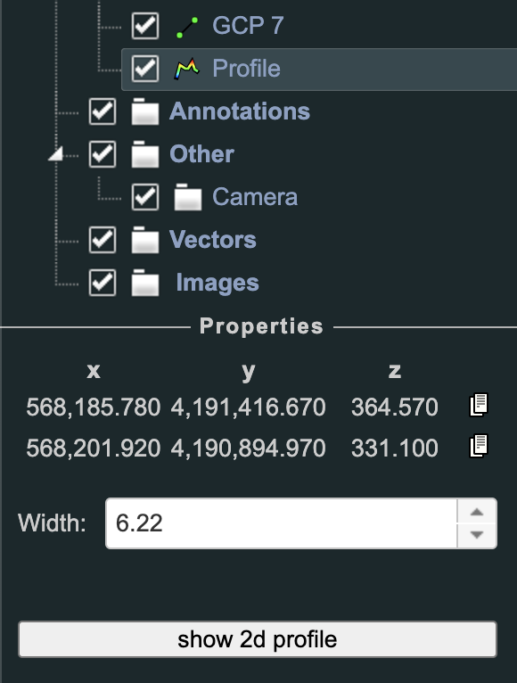
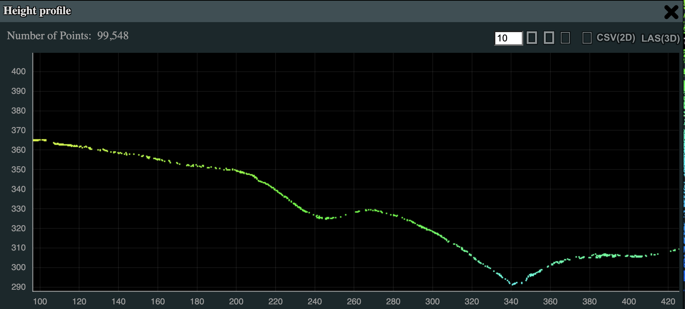

# Deliverables

Depending on the selections made during the processing step your data deliverables will change. However, all data processed will result in a 3D pointcloud which can be viewed and analyzed in our Rock Cloud Data Visualizer.

## Data Visualizer

{: style="width: 550px;margin:0 auto;display:block;"}

The Rock Cloud has a powerful data visualizer built right in. There are hundreds of different ways to view and analyze your data using our data visualizer. Below are just a few of the most popular.

### Elevation and Intensity View

Open the Rock Visualizer Menu and click Scene --> Select 'Project' in the object tree --> Change the 'Attribute' selection to 'elevation' or 'intensity'.

### Display Ground Only

Open the Rock Visualizer Menu and click 'Filters' --> Select only 'ground' classification.

{: style="width: 300px;margin:0 auto;display:block;"}

### Height Profile

Open the Rock Visualizer Menu and click 'Tools' --> Select the 'Height Profile' icon . --> Click once on your point cloud to select the starting point for the height profile, click again for the ending point, then right click to finish the selection process.

In the Rock Visualizer Menu select 'Scene' --> Select the 'Profile' in the Objects tree --> Click 'show 2d profile' button.

{: style="width: 300px;margin:0 auto;display:block;"}

Then you will be presented with the Height Profile Viewer. The height profile units is meters.

{: style="width: 600px;margin:0 auto;display:block;"}

### Annotate

The Project owner is able to place annotations on the point cloud and set the default view for the point cloud.

Open the Rock Visualizer Menu and click 'Tools' --> Select the Annotation icon .

Once selected you can click on the point cloud to place the annotation pin. Scroll down in the sidebar to change the properties of the title and description. To save the annotations and the default camera view, select the 'Set Defaults' link in the sidebar.

{: style="width: 300px;margin:0 auto;display:block;"}
