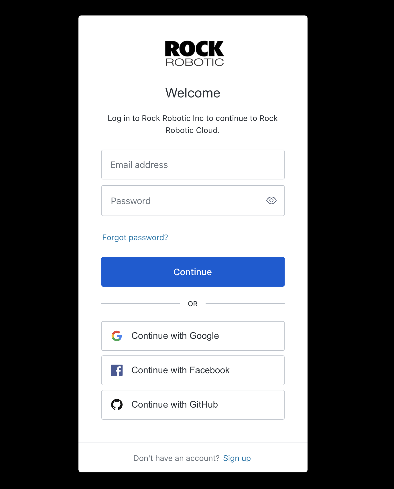
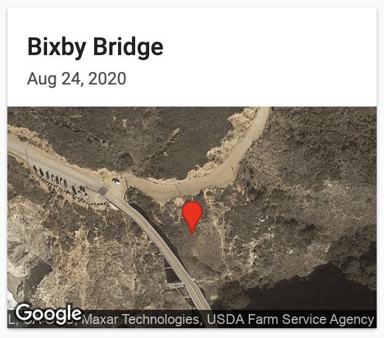
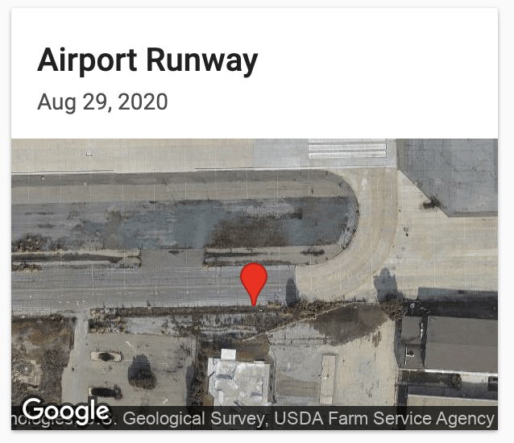
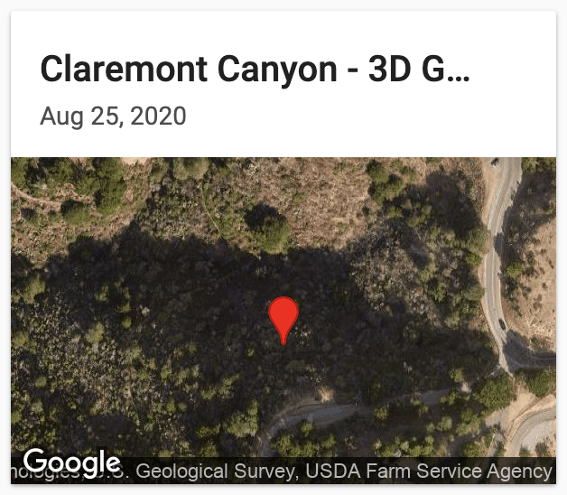

# Rock Robotic cloud

The Rock Robotic Cloud is an all-in-one LiDAR cloud hosting and processing solution. We did the hard work so you can can easily acquire your LiDAR data with the Rock Robotic R1a, upload to our [secure servers](https://www.rockrobotic.com/platform-and-data-security), and see results. [Create a free Rock Robotic Cloud account](https://cloud.rockrobotic.com) today so see some demo datasets.

## Create account

Upon navigating to https://cloud.rockrobotic.com you will be asked to create an account secured by two-factor authentication.

## Demo Projects

Once logged in you will have access to a number of demo projects. Each of these demo projects give you the experience of the Rock Robotic Cloud Platform.

 

Learn more about the [Creating your first Project](project.md).
