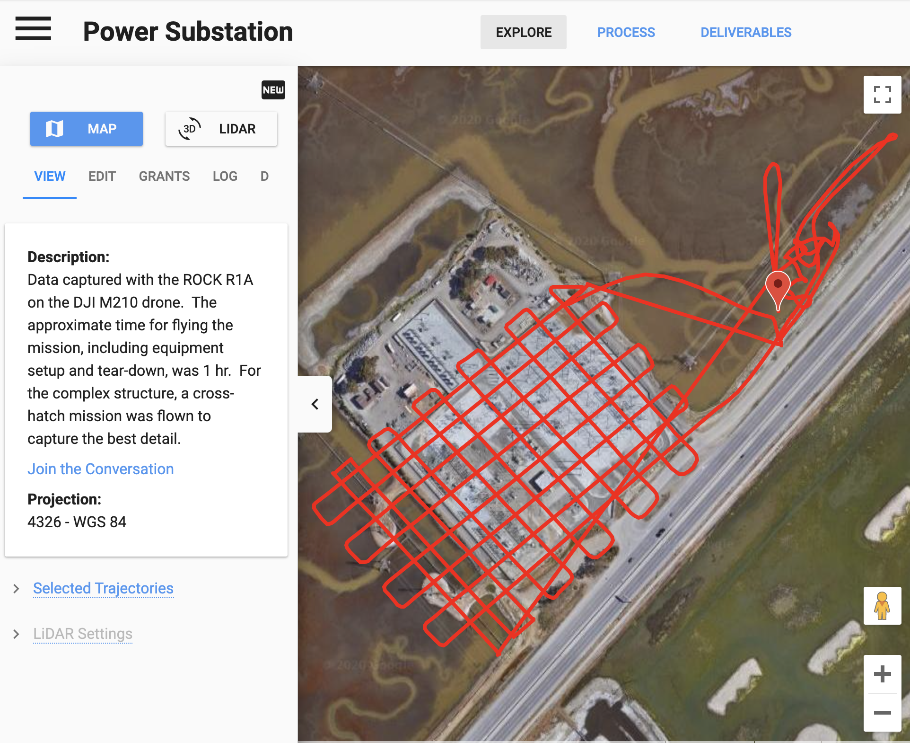
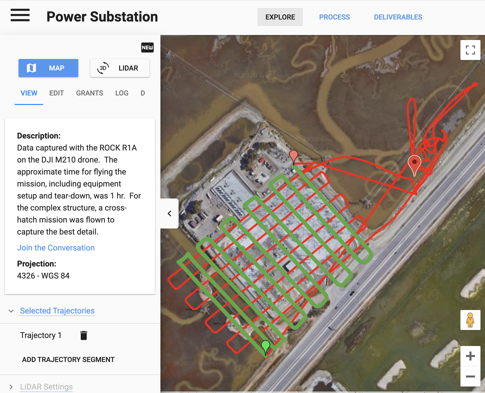
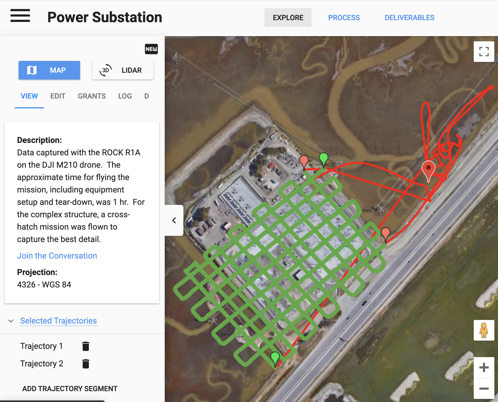

# Process

Once your project is created and your data is uploaded, you are now ready to submit your project for processing. Simply select your flight lines and click the 'Process' button and you are on your way.

## Select Flight Lines

After uploading your data you are presented with the LiDAR mission flight lines. For the post-processing to render the most accurate data, it is important to limit the point cloud to only the data collected when you were over the target and not the data collected while performing flight calibrations or flying to/from the target flight lines.

For instance, here are the flight lines for the Power Substation dataset:

{: style="margin:40px auto 40px auto;display:block;"}

You can see the calibration flight lines towards the top right of the image and there are flight lines to/from the target area. We want to specify the flight lines over the Power Substation so the data is accurate and clean.

To do this, click on the flight line to select a start and a stop point for the target trajectory.

{: style="margin:40px auto 40px auto;display:block;"}

In this case we have multiple trajectories to specify because we changed batteries out half-way through the cross-hatch mission. Therefore, we want to select two start/stop trajectory missions.

{: style="margin:40px auto 40px auto;display:block;"}

You can create as many trajectory segments as necessary to ensure you specify the flight lines where you are over the data acquisition target.

## Process

After your trajectories are selected, you are ready to submit the project for processing. Simply click the Process link at the top of you project, select the deliverables you would like and you will be notified once the processing is complete.

## Point Cloud

A 3D point cloud is the most basic deliverable. This is delivered as a downloadable .las file and is viewable in our Rock Cloud Data Visualizer. If you uploaded your ground control points you will also receive a report on the global accuracy of the point cloud.

## DEM and Contours

Processing your data into a Digital Elevation Model and Contour file gives you several deliverables.

  1. 3D Ground Classified Point cloud (.las format)
  1. Digital Elevation Model (.tif format)
  1. Contour files (.shx, .dbf, .shp formats)

## Tokens

The Rock Robotic Cloud uses a token system for cloud processing. The number of tokens for a particular deliverable is determined by the deliverable type and the amount of LiDAR data to be processed.

To give you an idea of scale, the [Airport Runway dataset](https://cloud.rockrobotic.com/project/28) is approximately .125 square kilometers and would cost 0 tokens to receive a 3D point cloud and 2 tokens to receive a DEM and contours.

[Let's look at the data!](deliverables.md)
