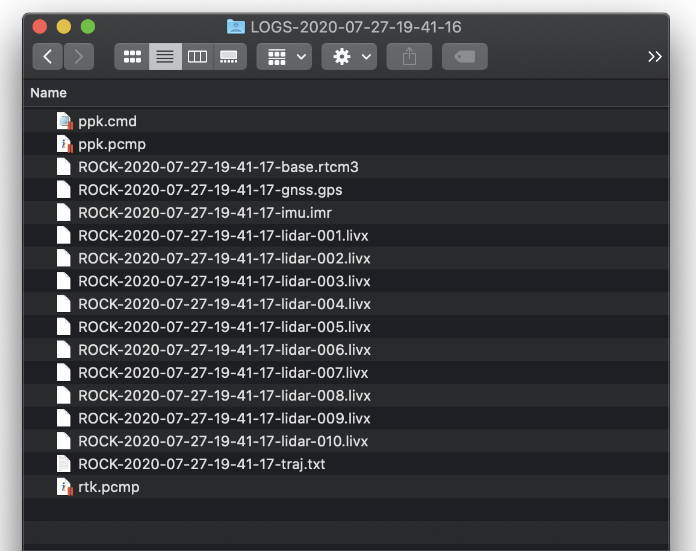
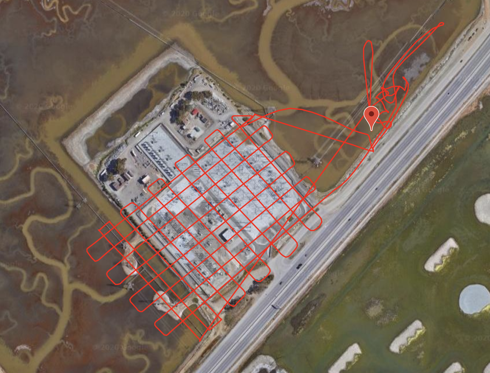

# Projects

Creating a project allows you to upload all of your LiDAR data and submit for processing.

## Add New Project

Simply click 'Add New Project'

And you will be presented with an easy and intuitive interface to upload your data.

## Project data

When you have completed a flight with your R1A and the unit is shut down, simply remove the USB stick from the unit and insert into your computer. You will see a folder that looks similar to this:

Simply select all of these files and upload them into the project data section.

## Ground Control Points

If you have a Pro plan you will have the ability to add one or more ground control points to your project. These ground control points will be used to improve the global accuracy of your LiDAR deliverables and they will be visible in the Rock Cloud Data Visualizer.

## Base Station

When performing a LiDAR survey you will have used a properly placed base station.

[Learn more about placing the base from the dedicated article in our docs.](../tutorials/Placing-the-Base.md)

After completing the base station data collection you will have a RINEX .obs file and a .nav file. Upload both of those files into the Base Station section. Additionally, you will need to enter the measurements for the height of the base station above the ground in meters. See [Measuring Base Height](../tutorials/Placing-the-Base.md#measuring-base-height) for more information.

## Project location

The project location will automatically be calculated if you are using the R1A. However, you can update the project location if you are not.

## Save the Project

Once complete, save your project and see your flight on the map.

[Time to process your data!](process.md)
