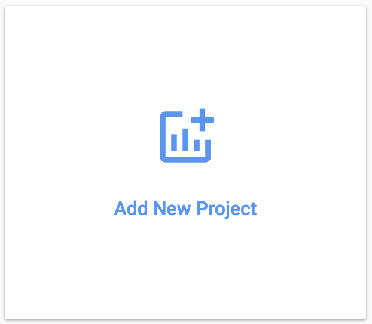
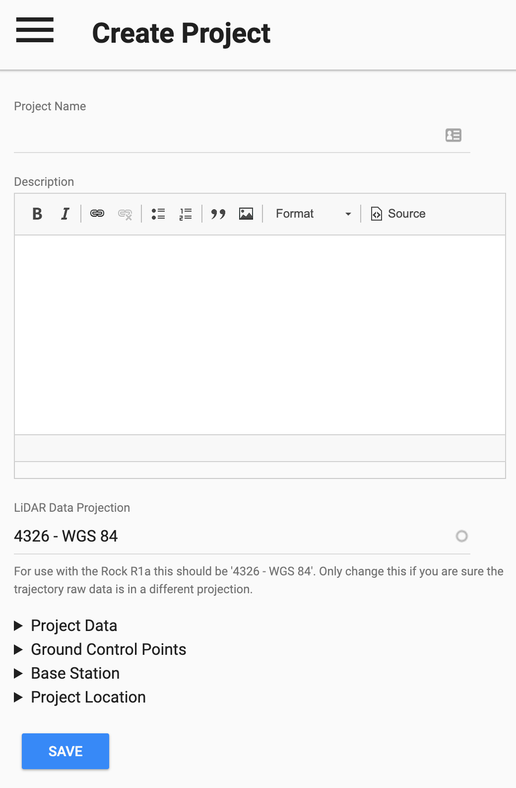

# Projects

Creating a project allows you to upload all of your LiDAR data and submit for processing.

## Add New Project

Simply click 'Add New Project'

{: style="width: 300px;margin:0 auto;display:block;"}

And you will be presented with an easy and intuitive interface to upload your data.

{: style="width: 300px;margin:0 auto;display:block;"}

## Project data

The two major file types that the ROCK Cloud suppors is .las and .laz. LAZ files are compressed and lossless LAS files. The compression of these files can be extraordinary. We recommend that all .las files be converted to .laz files prior to upload. If converted prior to upload, there will be a substantial savings in upload time and cloud storage space used.

Visit [laszip.org](https://laszip.org/) to download the command-line version 'laszip-cli.exe' or the GUI version 'laszip.exe'.

## Ground Control Points

If you have a Pro plan you will have the ability to add one or more ground control points to your project. These ground control points will be used to improve the global accuracy of your LiDAR deliverables and they will be visible in the Rock Cloud Data Visualizer.

## Project location

The project location will automatically be calculated if the las/laz file uploaded contains the appropriate header information or if the correct projection information is specified on the project page. However, you can manually update the project location if the location cannot be found.

## Save the Project

Once complete, save your project and your data will be queued up for processing. Processing typically takes from 1-5 minutes to process. Once you see the LIDAR button, you know your project is ready to view.

[Time to process your data!](process.md)
