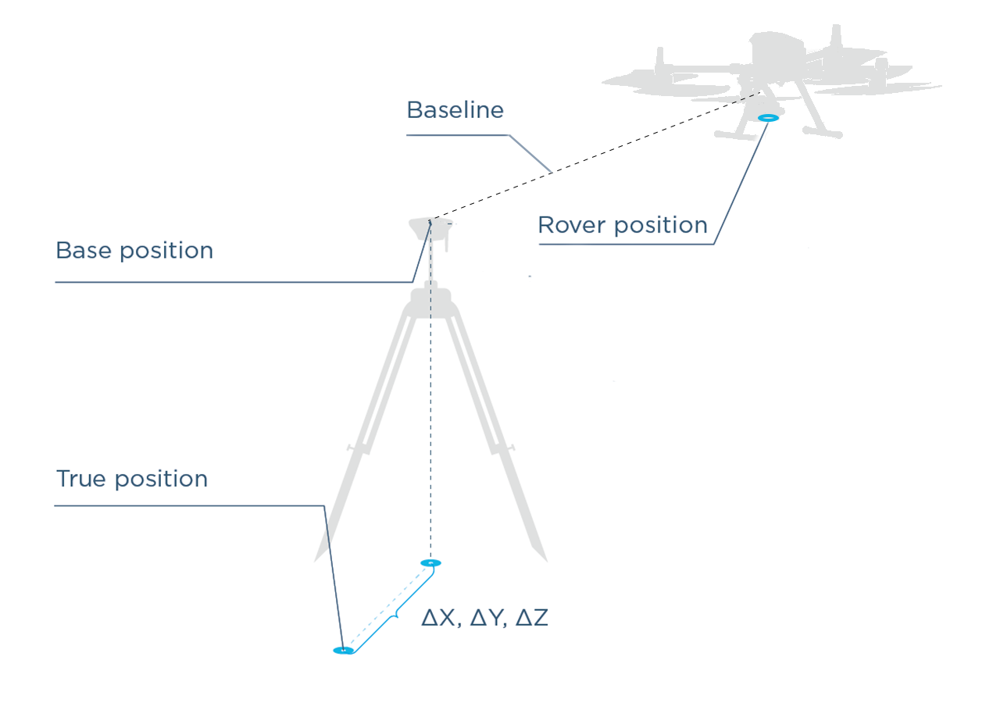
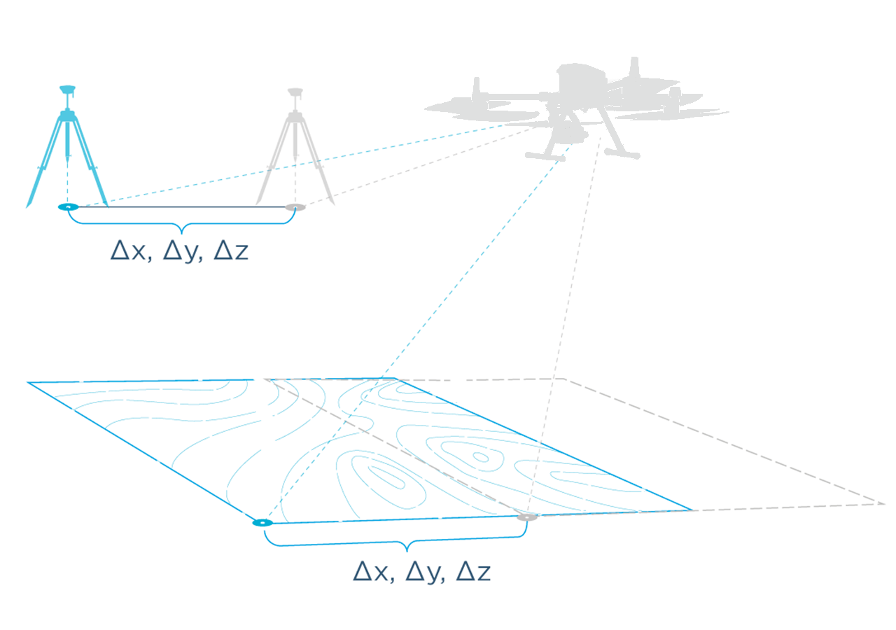

# Placing the Base Station
* [Measuring Base Height](#measuring-base-height)

## Overview

LiDAR data acquisition requires 2 receivers. One of them is stationary and is called “base station”, the other one, on the ROCK R1A, is the “rover”. The base station measures errors, and knowing that it is stationary transmits corrections to the rover (refer to How RTK and PPK works for more information about RTK and PPK). Typically the distance between the Base and the R1A rover shouldn't exceed 10 km due to the ionospheric effect. A general rule of thumb is, you will lose 2 parts in accuracy per million.  (i.e. at 10 km you will lose 2 cm of accuracy)  Because of this we recommend to always have a base station located within 10 km of your project area.

This article will give you a good understanding of different ways to set up the base to help you attain the desired accuracy for your application.

In this tutorial we will show discuss 3 scenarios for setting up your base.

* Setting up over known Point (High Global Accuracy)
* Setting up over unknown (Post-Processing Position, High Global Accuracy)
* Setting up over unknown (relative accuracy)

## Absolute and relative position

ROCK cloud has several ways to determine your position with varying levels of accuracy. Let's take a look at the illustration below (figure 1). The ROCK Cloud algorithm can precisely calculates the distance between the base and R1A rover. This distance is called the Baseline. The R1A rover position is precisely determined relative to the Base position.  The more precisely we can locate our base station then the more accurate our location for the rover will be, and as a result, the accuracy for our LiDAR data.  Any offset from the true location on the base station from the true location will be directly applied to the rover coordinates offset, and by extension to our LiDAR data.  

{: style="width: 600px;margin:0 auto;display:block;"}

  <figcaption>Figure 1</figcaption>

It is often enough to know the precise position of an object relative to other objects inside the scan area.  This would preserve measurements made on the LiDAR model, but lose where these measurements are located on earth.  However, for applications like surveying and mapping it is critical to get an accurate absolute position for your base station. In this case, the offset ΔX, ΔY, ΔZ between actual True position and the Base station position should be avoided or reduced.

!!! danger ""
    The absolute position of the rover and therefore the LiDAR data is accurate only to the same accuracy as the position of the base station.

In the below figure 2 is an illustration showing the effects of the base station location
being off from the true location.  As you can see, if the base station computed location is off from the true position, then the R1A rover and likewise the LiDAR data is shifted by the same amount.  

Next, we will discuss 3 methods of locating your base station to be uploaded to the ROCK cloud.

{: style="width: 600px;margin:0 auto;display:block;"}

    <figcaption>Figure 2</figcaption>

## Ways to Set the Base Station

* Setting over a Known Point
* Setting over an unknown point with post processing position (PPP)
* Unknown point, don't care :)

####Setting Up Base Over a Known Point

It is often the case that you will arrive on a job site that has already been surveyed and there exists a survey benchmark on this job site.  Figure 3 depicts several examples of common job site survey benchmarks/markers/monuments.

{: style="width: 600px;margin:0 auto;display:block;"}

    <figcaption>Figure 3</figcaption>

This is the best case scenario. In this procedure, you will place your base station directly over the center point of the survey marker.  After the base station is secured and leveled above the marker, then you will take an accurate measurement of your base station height.  See [Measuring Base Height](#measuring-base-height) for a detailed explanation of measuring the base height.

!!! danger "Pay Attention!"
    The mismeasured height of the antenna above the mark is probably the most pervasive and frequent blunder in GPS control surveying.

## Measuring Base height
