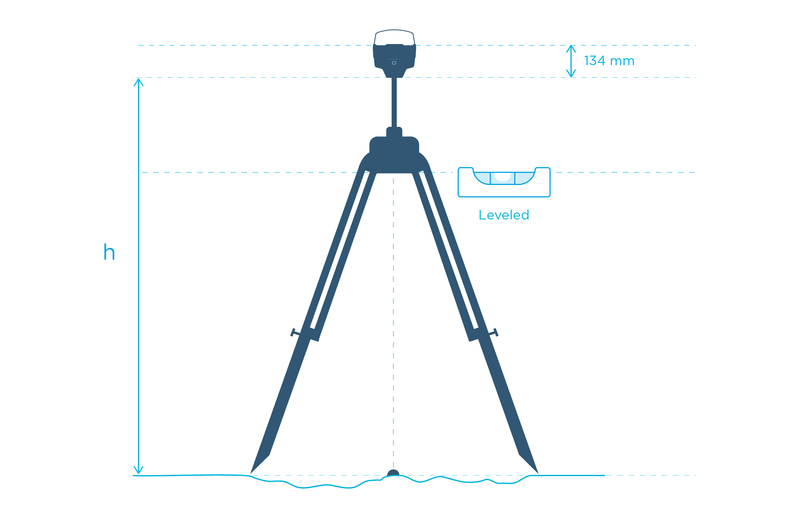

# Placing the Base Station
* [Measuring Base Height](#measuring-base-height)

!!! notice
    For documentation specific to the Emlid Reach RS2 visit [RS2 documentation](https://docs.emlid.com/reachrs2/)

## Overview

LiDAR data acquisition requires 2 receivers. One of them is stationary and is called the “base station”, the other one, on the ROCK R1A, is the “rover”. Both the base station and the rover receives and logs GNSS observations. These observations (combined with precise IMU data on the LiDAR) can be merged together in the PPK processing step to create a highly accurate trajectory of the rover. 

This article will give you a good understanding of different ways to set up the base to help you attain the desired accuracy for your application.

In this tutorial we will show discuss 3 scenarios for setting up your base.

* Setting up over known Point (high global accuracy)
* Setting up over unknown Point but Post-Processing to accurately determine the base station point (high global accuracy)
* Setting up over unknown (high relative accuracy)

## Absolute and relative position

ROCK Robotic pre-processing software has several ways to determine the position of the LiDAR data with varying levels of accuracy. Let's take a look at the illustration below (figure 1). The algorithms can precisely calculates the distance between the base and R1A rover. This distance is called the Baseline. The R1A rover position is precisely determined relative to the Base position.  The more precisely we can locate our base station onto the world, then the more accurate our location for the rover will be. The accuracy of the Rover location directly translates to the the accuracy for the LiDAR data.  Any offset from the true location on the base station from the true location will be directly applied to the rover coordinates offset, and by extension to our LiDAR data.  

{: style="width: 600px;margin:0 auto;display:block;"}

  <figcaption>Figure 1</figcaption>

### Absolute Accuracy

Based on the information above, in order to have your LiDAR data be Absolutely Accurate to the world, then the location of your base station must be extremely accurate. In practice this is done one of two ways:

1) A surveyor has already staked out control points on the land you are performing a LiDAR scan on and you use one of those known points, or
2) You use a service such as [OPUS](https://geodesy.noaa.gov/OPUS/index.jsp) in the USA to post process your base station data to determine the precise location.

### Relative Accuracy

It is often enough to know the precise position of an object relative to other objects inside the scan area.  This would preserve measurements made on the LiDAR model, but lose where these measurements are located on earth. If your LiDAR scan does not depend on knowning the absolute location on earth, then you do not need to know the precise location of your base station.

!!! danger ""
    The absolute position of the rover and therefore the LiDAR data is accurate only to the same accuracy as the position of the base station.

In the below figure 2 is an illustration showing the effects of the base station location
being off from the true location.  As you can see, if the base station computed location is off from the true position, then the R1A rover and likewise the LiDAR data is shifted by the same amount.  

Next, we will discuss 3 methods of locating your base station to be uploaded to the ROCK cloud.

{: style="width: 600px;margin:0 auto;display:block;"}

    <figcaption>Figure 2</figcaption>

## Base Station Distance from Scan Area

The distance between the Base and the R1A rover shouldn't exceed 10 km. A general rule of thumb is, you will lose 2 parts in accuracy per million.  (e.g., at 10 km you will lose 2 cm of accuracy)  Because of this we recommend to always have a base station located within 10 km of your project area.

## Ways to Set the Base Station

* Setting over a Known Point
* Setting over an unknown point with post processing position (PPP)
* Unknown point

### Setting Up Base Over a Known Point

It is often the case that you will arrive on a job site that has already been surveyed and there exists a survey benchmark on this job site.  Figure 3 depicts several examples of common job site survey benchmarks/markers/monuments.

{: style="width: 600px;margin:0 auto;display:block;"}

    <figcaption>Figure 3</figcaption>

This is the best case scenario. In this procedure, you will place your base station directly over the center point of the survey marker.  After the base station is secured and leveled above the marker, then you will take an accurate measurement of your base station height.  See [Measuring Base Height](#measuring-base-height) for a detailed explanation of measuring the base height.

!!! danger "Pay Attention!"
    The mismeasured height of the antenna above the mark is probably the most pervasive and frequent blunder in GPS control surveying.

If you collect your base station data over a known point, then you will be able to use that known point (converted to WGS 84) when entering your base station location into the ROCK Pre-processing Software.

### Setting over an unknown point with post processing position (PPP)

If you arrive at a jobsite and there is no survey control placed and you want an absolutely accurate LiDAR survey, then you will need to determine the precise position of your base station. In the United States this typically means logging RINEX observations of your base station location for 4+ hours and then submitting to a service such as OPUS more than 24 hours after the observations were taken. OPUS is able to use its network of observation stations and satallites to process your base station data in order to find its precise location.

Once you determine the precise position using a service, then you will be able to use that known point (converted to WGS 84) when entering your base station location into the ROCK Pre-processing Software.

### Unknown Point (Relative position)

If you do not need to know the absolute position of your LiDAR data, then you can simply use the average position calculated from your logged base station data. This will generally result in your LiDAR data being within 2.5 meters of the absolute position.

## Measuring Base height

The base station height will need to be captured when the base station is placed out in the field. Below is an image of the Reach RS2 receiver on a tripod. We often use this receiver for our LiDAR scans and is a good illustration for measuring the base. When measuring the base height you will want to record **h** in the illustration below. Then when you use the base station data for services such as OPUS, you will want to enter in your receiver height as **h + 134mm**.

!!! danger ""
    134mm is the antenna offset for the Reach RS2. If you are using a different base station you will need to check with the manufacturer for your antenna offset.

{: style="width: 800px;margin:0 auto;display:block;"}