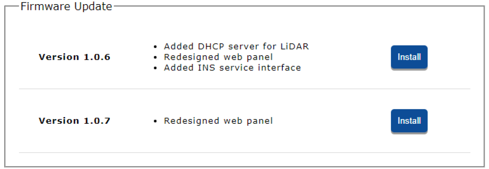

# Firmware Update

Rock Robotic may occasionally provide a firmware update for the R1a. When this occurs, load the firmware update file onto the USB drive and connect the drive to the R1a.

Inside the “Firmware” tab window under “Settings” you can install firmware updates by clicking on the button labeled “Install”.

{: style="width: 650px;margin:0 auto;display:block;"}
