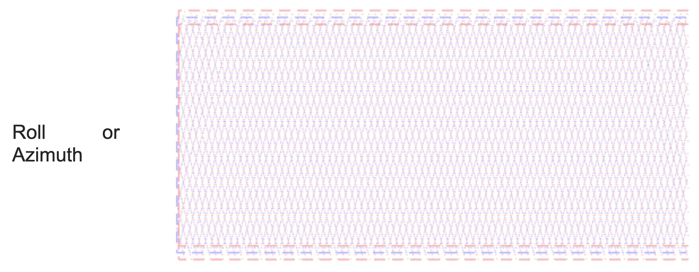
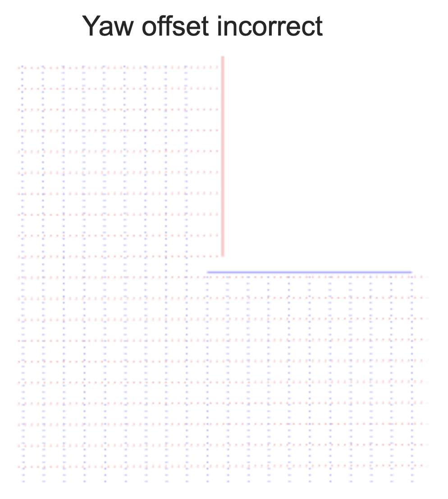
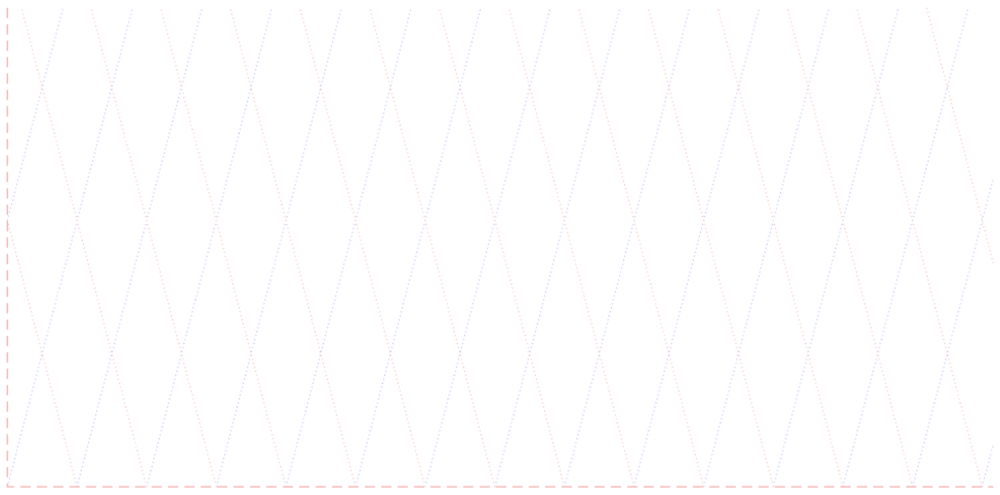

# R1A Boresighting

Remote Sensing Payload Instrument (R1A) – consists of a LiDAR and an Inertial Navigation System (INS). In order to accurately georeference the point clouds generated by the LiDAR it must be aligned with the Inertial Measurement Unit (IMU) of the INS used to generate georeferenced trajectory. Moreover, each laser in a multi-laser LiDAR, like the Velodyne VLP-16 used in R1A, must be properly aligned. This alignment process is called &quot;Boresighting&quot;, and is described in this manual. Boresighting is performed based on a scan of an area having a special feature: a tall vertical edge. This edge can be a corner of a building or a tall tower or pole. The scan can be done using a multi-copter drone or a car as the carrier vehicle. Generally, car boresighting is more convenient, but drone boresighting may be preferred if the area used for boresighting is not suited for a car to drive in the necessary pattern during procedure. This document discusses car boresighting.

## LiDAR boresighting and calibration – drive pattern

{: style="width: 100%;margin:0 auto;display:block;"}

Drive Pattern Notes:

- Red lines are critical – they need to be performed as specified
- Blue lines are not critical – they can be performed anywhere
- Velocity on the red lines should be \&lt;5 m/sec
- Before and after the boresighting pattern, the following convergence maneuvers must be performed to ensure good observability of IMU heading:

1. Straight drive forward, for duration of at least 5 seconds, at least 5 m/sec
2. Left and right turns in motion, at least 90 degrees each
3. Boresighting pattern
4. Left and right turns in motion, at least 90 degrees each
5. Straight drive forward, for duration of at least 5 seconds, at least 5 m/sec

- LiDAR should be mounted on the vehicle with its axis pitched up about 15 degrees

## LiDAR laser alignment parameters

The Velodyne VLP-16 lasers have the following misalignment angles:

* Common for all lasers:
	* Yaw offset between IMU and LiDAR
	* Pitch offset between IMU and LiDAR
	* Roll offset between IMU and LiDAR
* Individual for each laser:
	* Rotation offset (&quot;Azimuth&quot;) of the laser (zero for one of the lasers used as reference, because this offset is coupled with roll offset between IMU and LiDAR)
	* Conicity offset (&quot;Elevation&quot;) of the laser (if the laser is perfectly calibrated, then it is the LiDAR reference elevation, zero for laser #1)

Each alignment parameter has its own effect on scan line positions for the back and forth scans of the critical area above.

Here is the effect of each parameter on laser #1 clouds from East-West scan of the Critical Area when the pitch of the LiDAR axis is 15 degrees.

It is assumed that when the alignment parameters are correct, all edges in the critical area match in each of the scans (forward and backward).

That means:

1. The IMU-antenna offset is correct.
2. the IMU heading convergence is good.
3. The IMU-LiDAR linear offsets are set correctly.

Blue shows the scans when all alignment parameters are correct. Pink shows the scans when the respective alignment parameter is incorrect.

{: style="width: 100%;margin:0 auto;display:block;"}
{: style="width: 100%;margin:0 auto;display:block;"}
{: style="width: 100%;margin:0 auto;display:block;"}
{: style="width: 100%;margin:0 auto;display:block;"}

Obviously, edge mismatches in Pitch, Roll, and Elevation are very well observable between back and forth scans of the critical area. They can be corrected separately from each other by aligning the appropriate edges in the two clouds.

Yaw offset, however, has very poor observability. It just moves the vertical edge horizontally in the same direction in both clouds, for example, forward (West) in the West scan and backward (West again) in the East scan.

This is where the North-South scan becomes helpful. If we look at both scans of the critical area from the top after correcting all other alignment parameters, we will see the effect of Yaw immediately.

Here, in a zoomed view of the critical area, blue is the East-West scan (both directions), pink is the North-South scan (both directions).

|  |  |
| --- | --- |
| {: style="width: 100%;margin:0 auto;display:block;"} | {: style="width: 100%;margin:0 auto;display:block;"} |

The edges from the two sets of clouds can be aligned by adjusting the Yaw offset.

So, if all parameters of laser #1 are incorrect, the clouds will look like this (blue is the East scan, pink is the West scan):

{: style="width: 100%;margin:0 auto;display:block;"}

After adjusting Roll, the clouds will look like this:

{: style="width: 100%;margin:0 auto;display:block;"}

Now, let&#39;s focus on the bottom of the vertical edge for adjusting Elevation.

Before:

{: style="width: 100%;margin:0 auto;display:block;"}

After:

{: style="width: 100%;margin:0 auto;display:block;"}

And then, the top of the vertical edge for adjusting Pitch.

Before:

{: style="width: 100%;margin:0 auto;display:block;"}

After:

{: style="width: 100%;margin:0 auto;display:block;"}

One catch is that after adjusting Yaw:

{: style="width: 100%;margin:0 auto;display:block;"}

We get back to the side view of the East-West scan, and see this in zoomed bottom of the vertical edge:

{: style="width: 100%;margin:0 auto;display:block;"}

That is because Yaw and Roll are slightly coupled because of LiDAR tilt of 15 degrees. So, the final step is to refine Roll adjustment:

{: style="width: 100%;margin:0 auto;display:block;"}

This finalizes the LiDAR boresighting and reference laser calibration.

## Calibrating all lasers

Calibration workflow starts with boresighting using one laser. It can be any laser; the only difference is that the laser used for boresighting will have a zero Azimuth offset. All other lasers will have Azimuth offsets relative to the reference laser.

The reference laser is selected in PCMaster software, where its Azimuth offset is set to zero, the trajectory parts for both directions of North-South and East-West scans are selected and the boresighting process is done as described above.

Then, the Roll is changed and clouds regenerated until top and bottom edges of the building are aligned in the East-West scans. They will also be aligned in the North-South scans.

After that, the Elevation is changed to align the vertical edge of the building at the altitude of the LiDAR in the East-West scans. It will also be aligned in the North-South scans.

If the vertical edge is not aligned at the top of the building, Pitch is changed until it is aligned.

Then the Yaw offset is corrected. For that, the vertical edge from both East-West and North-South scans is aligned.

And the last step is refining the Roll offset.

After the reference laser is calibrated, it is selected in PCMaster in pair with each of the other lasers. Then, the vertical edges from the two lasers are aligned by changing the other laser&#39;s Elevation, and the horizontal edges are aligned by changing the other laser&#39;s Azimuth. **The reference laser&#39;s Azimuth must remain zero**.

Before (reference laser is blue, the other laser is pink):

{: style="width: 100%;margin:0 auto;display:block;"}

After:

{: style="width: 100%;margin:0 auto;display:block;"}

## Sensitivity and range

This boresighting method uses the fact that linear mismatches caused by angular offsets grow with distance. The rule of thumb is that every milliradian (0.06 degree) of angular offset will produce 2 cm of linear mismatch between the two clouds for every 10 meters of distance to the wall. That means, the wall should be as far from the trajectory as the lidar range allows to reach the top of the wall. Having the wall 40-50 meters away will result in an 8-10 cm mismatch for every milliradian of angular offset.

One exception is the Pitch offset. Its observability depends on the height of the building. Every 10 meters of height will produce 2 cm of mismatch at the top for every milliradian of Pitch offset. That means, the building used should be as tall as possible.

Scanning with a low velocity allows for the increase of scan line density, which results in a better visibility of edges. It may also be beneficial to decrease the LiDAR scan rate to 300 RPM to increase the angular resolution of the scans.

## Storing the computed values

PCMasterGL, the software that is used for boresighting and laser calibration, saves the computed values in the PCMaster Project file. This file can be loaded onto the R1A device using the R1A Web interface. After that, the values will be recorded in the LiDAR scan files on the R1A device, and when those files are loaded in a newly created PCMaster Project, the values will also be automatically loaded there. In order to store the values, open the R1A Web interface and go to the Settings-\&gt;Boresight page. Then, click &quot;Read from PCMaster project&quot; and browse for the PCMaster Project file. After the file is selected, the computed values will be extracted from the file and stored in the R1A non-volatile memory.
